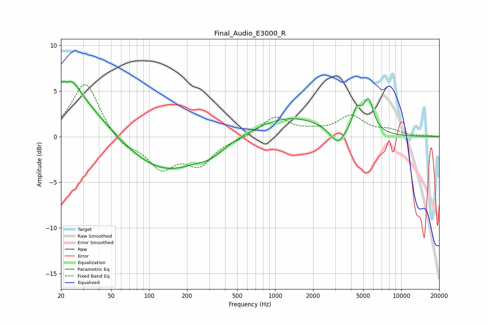

# Final_Audio_E3000_R
See [usage instructions](https://github.com/jaakkopasanen/AutoEq#usage) for more options and info.

### Parametric EQs
Apply preamp of -6.2 dB when using parametric equalizer.

|   # | Type    |   Fc (Hz) |    Q |   Gain (dB) |
|-----|---------|-----------|------|-------------|
|   1 | Peaking |        21 | 0.46 |         4.9 |
|   2 | Peaking |        22 | 5.48 |         3   |
|   3 | Peaking |        22 | 5.89 |        -3.1 |
|   4 | Peaking |        24 | 1.84 |         1.9 |
|   5 | Peaking |       130 | 0.44 |        -4   |
|   6 | Peaking |       309 | 1.69 |        -0.7 |
|   7 | Peaking |      1283 | 0.51 |         2.2 |
|   8 | Peaking |      3122 | 2.51 |        -1.8 |
|   9 | Peaking |      4432 | 4.13 |         2.2 |
|  10 | Peaking |      5496 | 3.46 |         3.5 |

### Fixed Band EQs
When using fixed band (also called graphic) equalizer, apply preamp of **-5.8 dB** (if available) and set gains manually with these parameters.

|   # | Type    |   Fc (Hz) |    Q |   Gain (dB) |
|-----|---------|-----------|------|-------------|
|   1 | Peaking |        31 | 1.41 |         6.1 |
|   2 | Peaking |        62 | 1.41 |        -1.3 |
|   3 | Peaking |       125 | 1.41 |        -3.2 |
|   4 | Peaking |       250 | 1.41 |        -2.8 |
|   5 | Peaking |       500 | 1.41 |        -0.2 |
|   6 | Peaking |      1000 | 1.41 |         2.1 |
|   7 | Peaking |      2000 | 1.41 |         0.4 |
|   8 | Peaking |      4000 | 1.41 |         2.1 |
|   9 | Peaking |      8000 | 1.41 |         0.6 |
|  10 | Peaking |     16000 | 1.41 |         0.1 |

### Graphs

