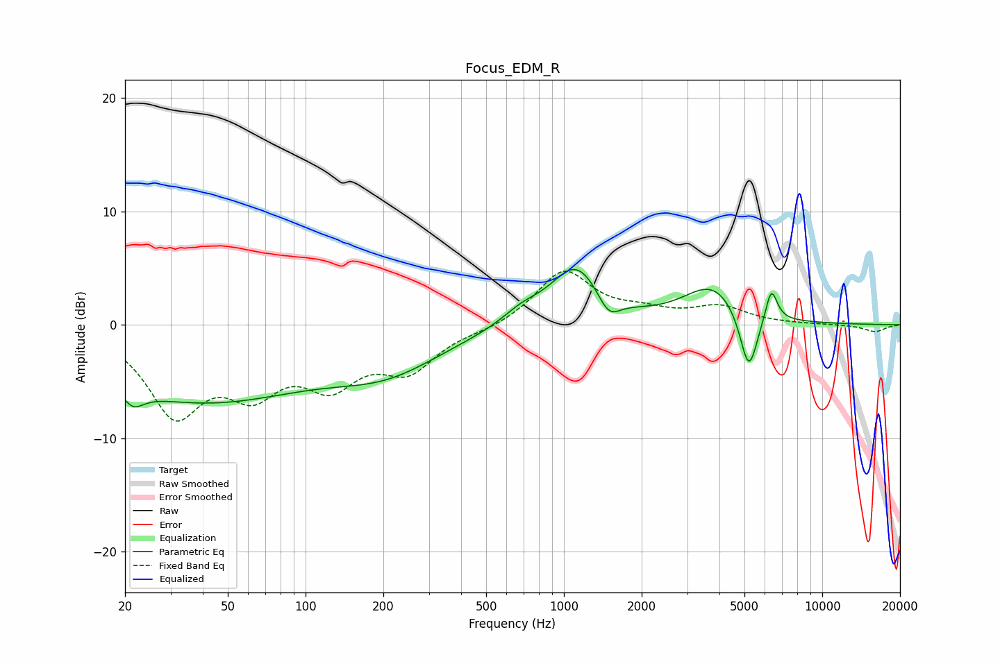

# Focus_EDM_R
See [usage instructions](https://github.com/jaakkopasanen/AutoEq#usage) for more options and info.

### Parametric EQs
Apply preamp of -5.0 dB when using parametric equalizer.

|   # | Type    |   Fc (Hz) |    Q |   Gain (dB) |
|-----|---------|-----------|------|-------------|
|   1 | Peaking |        21 | 3.86 |         4.2 |
|   2 | Peaking |        21 | 3.69 |        -5.8 |
|   3 | Peaking |        39 | 0.32 |        -6.5 |
|   4 | Peaking |       208 | 0.65 |        -3.2 |
|   5 | Peaking |       686 | 1.83 |         1.1 |
|   6 | Peaking |      1115 | 1.42 |         5.2 |
|   7 | Peaking |      1491 | 3.26 |        -2   |
|   8 | Peaking |      3771 | 1.25 |         3.4 |
|   9 | Peaking |      5197 | 4.01 |        -5.6 |
|  10 | Peaking |      6353 | 6    |         3   |

### Fixed Band EQs
When using fixed band (also called graphic) equalizer, apply preamp of **-4.8 dB** (if available) and set gains manually with these parameters.

|   # | Type    |   Fc (Hz) |    Q |   Gain (dB) |
|-----|---------|-----------|------|-------------|
|   1 | Peaking |        31 | 1.41 |        -7.4 |
|   2 | Peaking |        62 | 1.41 |        -4.8 |
|   3 | Peaking |       125 | 1.41 |        -4.4 |
|   4 | Peaking |       250 | 1.41 |        -3.6 |
|   5 | Peaking |       500 | 1.41 |        -0.4 |
|   6 | Peaking |      1000 | 1.41 |         4.7 |
|   7 | Peaking |      2000 | 1.41 |         0.9 |
|   8 | Peaking |      4000 | 1.41 |         1.5 |
|   9 | Peaking |      8000 | 1.41 |         0   |
|  10 | Peaking |     16000 | 1.41 |        -0.6 |

### Graphs

