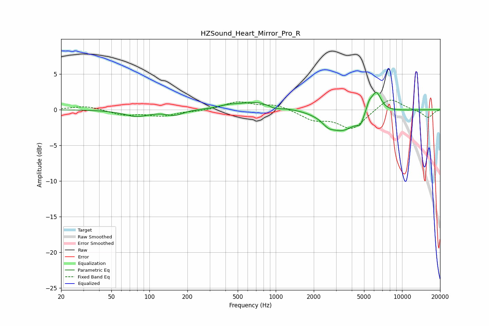

# HZSound_Heart_Mirror_Pro_R
See [usage instructions](https://github.com/jaakkopasanen/AutoEq#usage) for more options and info.

### Parametric EQs
Apply preamp of -2.5 dB when using parametric equalizer.

|   # | Type    |   Fc (Hz) |    Q |   Gain (dB) |
|-----|---------|-----------|------|-------------|
|   1 | Peaking |        79 | 1.44 |        -0.9 |
|   2 | Peaking |       158 | 2.12 |        -0.7 |
|   3 | Peaking |       427 | 1.85 |         0.3 |
|   4 | Peaking |       770 | 0.91 |         1.2 |
|   5 | Peaking |       983 | 2.31 |        -0.6 |
|   6 | Peaking |      2598 | 3.26 |        -0.7 |
|   7 | Peaking |      3364 | 1.19 |        -2.9 |
|   8 | Peaking |      4657 | 5.4  |        -1.1 |
|   9 | Peaking |      5485 | 6    |         1.1 |
|  10 | Peaking |      6244 | 3.43 |         3   |

### Fixed Band EQs
When using fixed band (also called graphic) equalizer, apply preamp of **-1.4 dB** (if available) and set gains manually with these parameters.

|   # | Type    |   Fc (Hz) |    Q |   Gain (dB) |
|-----|---------|-----------|------|-------------|
|   1 | Peaking |        31 | 1.41 |         0.5 |
|   2 | Peaking |        62 | 1.41 |        -0.7 |
|   3 | Peaking |       125 | 1.41 |        -0.8 |
|   4 | Peaking |       250 | 1.41 |        -0.2 |
|   5 | Peaking |       500 | 1.41 |         1.1 |
|   6 | Peaking |      1000 | 1.41 |         0.7 |
|   7 | Peaking |      2000 | 1.41 |        -1.3 |
|   8 | Peaking |      4000 | 1.41 |        -2.7 |
|   9 | Peaking |      8000 | 1.41 |         1.8 |
|  10 | Peaking |     16000 | 1.41 |        -1.1 |

### Graphs

