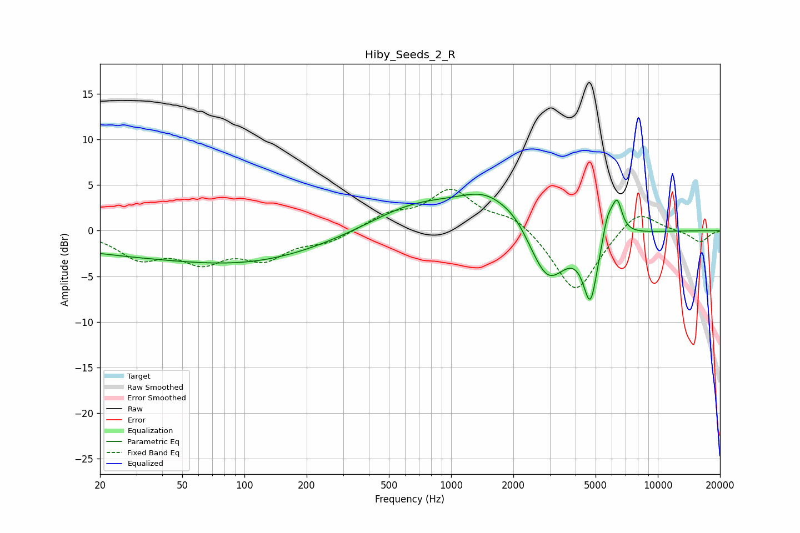

# Hiby_Seeds_2_R
See [usage instructions](https://github.com/jaakkopasanen/AutoEq#usage) for more options and info.

### Parametric EQs
Apply preamp of -4.1 dB when using parametric equalizer.

|   # | Type    |   Fc (Hz) |    Q |   Gain (dB) |
|-----|---------|-----------|------|-------------|
|   1 | Peaking |        50 | 0.19 |        -2.7 |
|   2 | Peaking |       107 | 0.43 |        -1.1 |
|   3 | Peaking |       674 | 0.64 |         2.7 |
|   4 | Peaking |      1515 | 0.97 |         3.6 |
|   5 | Peaking |      2076 | 2.17 |         0.8 |
|   6 | Peaking |      2932 | 1.53 |        -6.2 |
|   7 | Peaking |      4722 | 3.98 |        -7.1 |
|   8 | Peaking |      5695 | 5.34 |         2.1 |
|   9 | Peaking |      6049 | 3.63 |         1.4 |
|  10 | Peaking |      6380 | 6    |         2.8 |

### Fixed Band EQs
When using fixed band (also called graphic) equalizer, apply preamp of **-4.6 dB** (if available) and set gains manually with these parameters.

|   # | Type    |   Fc (Hz) |    Q |   Gain (dB) |
|-----|---------|-----------|------|-------------|
|   1 | Peaking |        31 | 1.41 |        -2.8 |
|   2 | Peaking |        62 | 1.41 |        -2.9 |
|   3 | Peaking |       125 | 1.41 |        -2.7 |
|   4 | Peaking |       250 | 1.41 |        -1.2 |
|   5 | Peaking |       500 | 1.41 |         1.6 |
|   6 | Peaking |      1000 | 1.41 |         4.3 |
|   7 | Peaking |      2000 | 1.41 |         1.6 |
|   8 | Peaking |      4000 | 1.41 |        -7   |
|   9 | Peaking |      8000 | 1.41 |         2.6 |
|  10 | Peaking |     16000 | 1.41 |        -1.3 |

### Graphs

