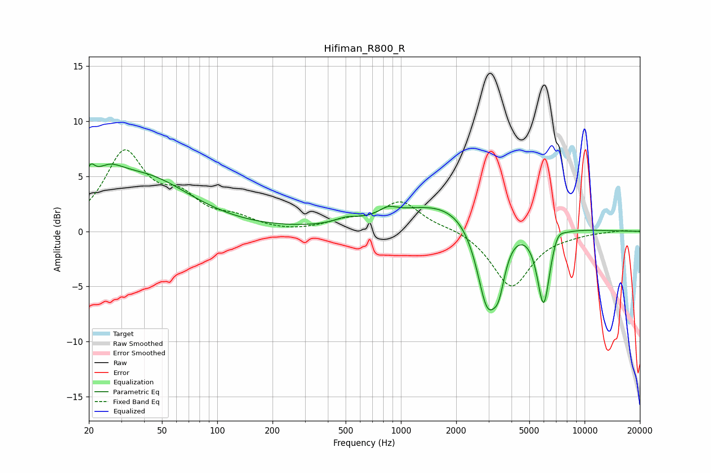

# Hifiman_R800_R
See [usage instructions](https://github.com/jaakkopasanen/AutoEq#usage) for more options and info.

### Parametric EQs
Apply preamp of -6.2 dB when using parametric equalizer.

|   # | Type    |   Fc (Hz) |    Q |   Gain (dB) |
|-----|---------|-----------|------|-------------|
|   1 | Peaking |        20 | 5.67 |         1.8 |
|   2 | Peaking |        25 | 1.65 |         2.2 |
|   3 | Peaking |        40 | 0.56 |         4.6 |
|   4 | Peaking |       503 | 2.47 |         0.4 |
|   5 | Peaking |       852 | 3.05 |         0.6 |
|   6 | Peaking |      2070 | 0.44 |         3.1 |
|   7 | Peaking |      2953 | 2.31 |        -8.4 |
|   8 | Peaking |      3414 | 4.31 |        -2.9 |
|   9 | Peaking |      5981 | 3.86 |        -7.3 |
|  10 | Peaking |      7098 | 4.18 |         1   |

### Fixed Band EQs
When using fixed band (also called graphic) equalizer, apply preamp of **-7.5 dB** (if available) and set gains manually with these parameters.

|   # | Type    |   Fc (Hz) |    Q |   Gain (dB) |
|-----|---------|-----------|------|-------------|
|   1 | Peaking |        31 | 1.41 |         6.9 |
|   2 | Peaking |        62 | 1.41 |         2.5 |
|   3 | Peaking |       125 | 1.41 |         1   |
|   4 | Peaking |       250 | 1.41 |        -0.1 |
|   5 | Peaking |       500 | 1.41 |         0.8 |
|   6 | Peaking |      1000 | 1.41 |         2.6 |
|   7 | Peaking |      2000 | 1.41 |         0.3 |
|   8 | Peaking |      4000 | 1.41 |        -5.1 |
|   9 | Peaking |      8000 | 1.41 |        -0.2 |
|  10 | Peaking |     16000 | 1.41 |         0.1 |

### Graphs

