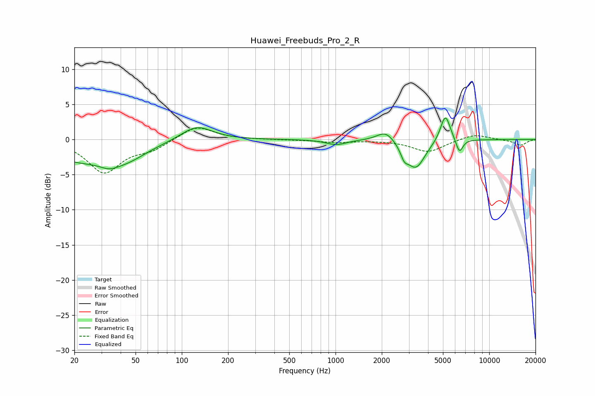

# Huawei_Freebuds_Pro_2_R
See [usage instructions](https://github.com/jaakkopasanen/AutoEq#usage) for more options and info.

### Parametric EQs
Apply preamp of -3.1 dB when using parametric equalizer.

|   # | Type    |   Fc (Hz) |    Q |   Gain (dB) |
|-----|---------|-----------|------|-------------|
|   1 | Peaking |        21 | 0.6  |        -2.7 |
|   2 | Peaking |        34 | 2.49 |        -0.8 |
|   3 | Peaking |        44 | 1.07 |        -1.9 |
|   4 | Peaking |       125 | 1.39 |         2.1 |
|   5 | Peaking |      1011 | 2.13 |        -0.7 |
|   6 | Peaking |      2125 | 2.45 |         1.6 |
|   7 | Peaking |      2801 | 5.99 |        -1.3 |
|   8 | Peaking |      3324 | 2.31 |        -4.1 |
|   9 | Peaking |      5183 | 4.3  |         3.9 |
|  10 | Peaking |      6399 | 6    |        -2   |

### Fixed Band EQs
When using fixed band (also called graphic) equalizer, apply preamp of **-1.7 dB** (if available) and set gains manually with these parameters.

|   # | Type    |   Fc (Hz) |    Q |   Gain (dB) |
|-----|---------|-----------|------|-------------|
|   1 | Peaking |        31 | 1.41 |        -4.6 |
|   2 | Peaking |        62 | 1.41 |        -1.3 |
|   3 | Peaking |       125 | 1.41 |         2   |
|   4 | Peaking |       250 | 1.41 |         0   |
|   5 | Peaking |       500 | 1.41 |        -0   |
|   6 | Peaking |      1000 | 1.41 |        -0.4 |
|   7 | Peaking |      2000 | 1.41 |        -0.1 |
|   8 | Peaking |      4000 | 1.41 |        -1.8 |
|   9 | Peaking |      8000 | 1.41 |         0.8 |
|  10 | Peaking |     16000 | 1.41 |        -0.8 |

### Graphs

