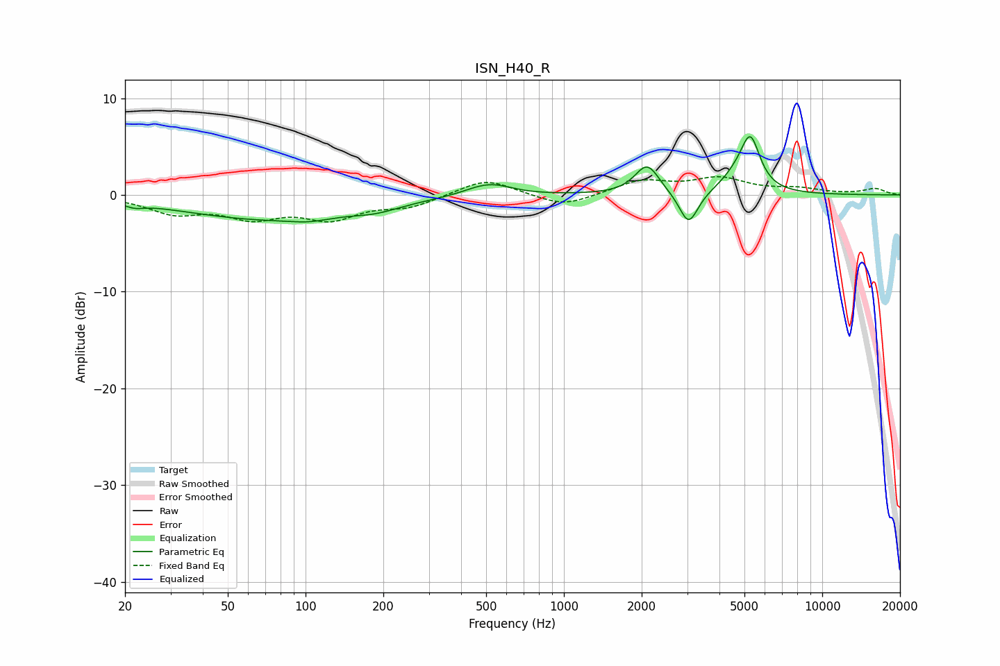

# ISN_H40_R
See [usage instructions](https://github.com/jaakkopasanen/AutoEq#usage) for more options and info.

### Parametric EQs
Apply preamp of -6.1 dB when using parametric equalizer.

|   # | Type    |   Fc (Hz) |    Q |   Gain (dB) |
|-----|---------|-----------|------|-------------|
|   1 | Peaking |        22 | 4.08 |        -0.4 |
|   2 | Peaking |        71 | 0.42 |        -2.5 |
|   3 | Peaking |       104 | 1.87 |        -0.4 |
|   4 | Peaking |       187 | 1.52 |        -0.6 |
|   5 | Peaking |       501 | 2.44 |        -0.5 |
|   6 | Peaking |       507 | 1.82 |         1.8 |
|   7 | Peaking |      2100 | 3.02 |         3.1 |
|   8 | Peaking |      3041 | 3.85 |        -3.5 |
|   9 | Peaking |      4696 | 2.26 |         1.5 |
|  10 | Peaking |      5273 | 3.79 |         5   |

### Fixed Band EQs
When using fixed band (also called graphic) equalizer, apply preamp of **-2.0 dB** (if available) and set gains manually with these parameters.

|   # | Type    |   Fc (Hz) |    Q |   Gain (dB) |
|-----|---------|-----------|------|-------------|
|   1 | Peaking |        31 | 1.41 |        -1.7 |
|   2 | Peaking |        62 | 1.41 |        -2   |
|   3 | Peaking |       125 | 1.41 |        -2.2 |
|   4 | Peaking |       250 | 1.41 |        -1.1 |
|   5 | Peaking |       500 | 1.41 |         1.8 |
|   6 | Peaking |      1000 | 1.41 |        -1.3 |
|   7 | Peaking |      2000 | 1.41 |         1.4 |
|   8 | Peaking |      4000 | 1.41 |         1.6 |
|   9 | Peaking |      8000 | 1.41 |         0.6 |
|  10 | Peaking |     16000 | 1.41 |         0.6 |

### Graphs

