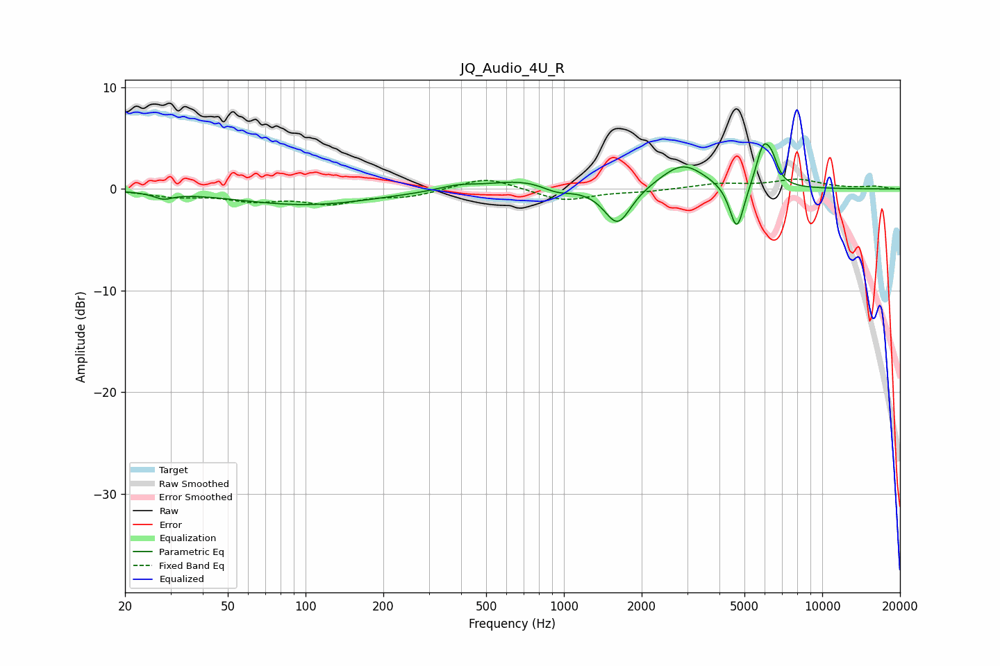

# JQ_Audio_4U_R
See [usage instructions](https://github.com/jaakkopasanen/AutoEq#usage) for more options and info.

### Parametric EQs
Apply preamp of -4.6 dB when using parametric equalizer.

|   # | Type    |   Fc (Hz) |    Q |   Gain (dB) |
|-----|---------|-----------|------|-------------|
|   1 | Peaking |        28 | 3.83 |        -0.6 |
|   2 | Peaking |       100 | 0.52 |        -1.5 |
|   3 | Peaking |       388 | 1.89 |         0.5 |
|   4 | Peaking |       689 | 1.13 |         0.9 |
|   5 | Peaking |       940 | 2.49 |        -0.6 |
|   6 | Peaking |      1615 | 2.73 |        -3.7 |
|   7 | Peaking |      2885 | 1.62 |         2.5 |
|   8 | Peaking |      4672 | 5.01 |        -4.7 |
|   9 | Peaking |      5907 | 4.93 |         3.9 |
|  10 | Peaking |      6391 | 6    |         1.7 |

### Fixed Band EQs
When using fixed band (also called graphic) equalizer, apply preamp of **-1.1 dB** (if available) and set gains manually with these parameters.

|   # | Type    |   Fc (Hz) |    Q |   Gain (dB) |
|-----|---------|-----------|------|-------------|
|   1 | Peaking |        31 | 1.41 |        -0.6 |
|   2 | Peaking |        62 | 1.41 |        -1   |
|   3 | Peaking |       125 | 1.41 |        -1.3 |
|   4 | Peaking |       250 | 1.41 |        -0.7 |
|   5 | Peaking |       500 | 1.41 |         1.2 |
|   6 | Peaking |      1000 | 1.41 |        -1.2 |
|   7 | Peaking |      2000 | 1.41 |        -0.2 |
|   8 | Peaking |      4000 | 1.41 |         0.5 |
|   9 | Peaking |      8000 | 1.41 |         0.9 |
|  10 | Peaking |     16000 | 1.41 |         0.2 |

### Graphs

