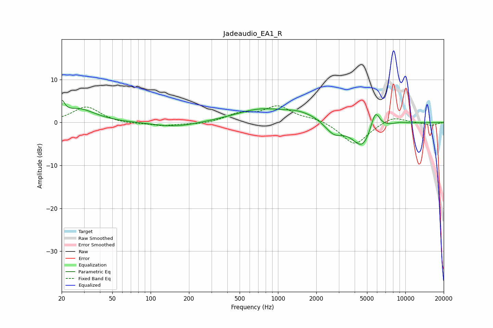

# Jadeaudio_EA1_R
See [usage instructions](https://github.com/jaakkopasanen/AutoEq#usage) for more options and info.

### Parametric EQs
Apply preamp of -5.3 dB when using parametric equalizer.

|   # | Type    |   Fc (Hz) |    Q |   Gain (dB) |
|-----|---------|-----------|------|-------------|
|   1 | Peaking |        20 | 6    |         3.2 |
|   2 | Peaking |        27 | 1.11 |         3.1 |
|   3 | Peaking |       156 | 0.85 |        -1.1 |
|   4 | Peaking |       744 | 0.68 |         3   |
|   5 | Peaking |      1435 | 1.39 |         1.3 |
|   6 | Peaking |      1892 | 1.87 |         0.6 |
|   7 | Peaking |      2751 | 2.11 |        -2.6 |
|   8 | Peaking |      4604 | 1.74 |        -5.9 |
|   9 | Peaking |      5796 | 3.76 |         5   |
|  10 | Peaking |      9153 | 2.68 |         0.3 |

### Fixed Band EQs
When using fixed band (also called graphic) equalizer, apply preamp of **-4.0 dB** (if available) and set gains manually with these parameters.

|   # | Type    |   Fc (Hz) |    Q |   Gain (dB) |
|-----|---------|-----------|------|-------------|
|   1 | Peaking |        31 | 1.41 |         3.7 |
|   2 | Peaking |        62 | 1.41 |        -0.4 |
|   3 | Peaking |       125 | 1.41 |        -0.8 |
|   4 | Peaking |       250 | 1.41 |        -0.5 |
|   5 | Peaking |       500 | 1.41 |         1.8 |
|   6 | Peaking |      1000 | 1.41 |         3.6 |
|   7 | Peaking |      2000 | 1.41 |         0.9 |
|   8 | Peaking |      4000 | 1.41 |        -5.3 |
|   9 | Peaking |      8000 | 1.41 |         1.6 |
|  10 | Peaking |     16000 | 1.41 |        -0.7 |

### Graphs

