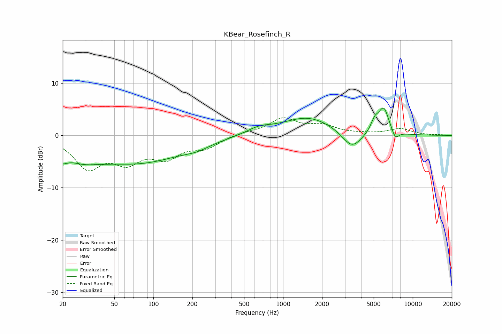

# KBear_Rosefinch_R
See [usage instructions](https://github.com/jaakkopasanen/AutoEq#usage) for more options and info.

### Parametric EQs
Apply preamp of -5.3 dB when using parametric equalizer.

|   # | Type    |   Fc (Hz) |    Q |   Gain (dB) |
|-----|---------|-----------|------|-------------|
|   1 | Peaking |        20 | 0.71 |        -5.4 |
|   2 | Peaking |        23 | 1.97 |         1.5 |
|   3 | Peaking |        83 | 0.43 |        -4.7 |
|   4 | Peaking |       216 | 1.44 |        -0.8 |
|   5 | Peaking |       651 | 1.52 |         1.1 |
|   6 | Peaking |      1557 | 0.72 |         3.5 |
|   7 | Peaking |      3397 | 1.86 |        -3.4 |
|   8 | Peaking |      5088 | 4.53 |         2.1 |
|   9 | Peaking |      5975 | 3.31 |         5   |
|  10 | Peaking |      7326 | 4.85 |        -1.7 |

### Fixed Band EQs
When using fixed band (also called graphic) equalizer, apply preamp of **-3.5 dB** (if available) and set gains manually with these parameters.

|   # | Type    |   Fc (Hz) |    Q |   Gain (dB) |
|-----|---------|-----------|------|-------------|
|   1 | Peaking |        31 | 1.41 |        -5.8 |
|   2 | Peaking |        62 | 1.41 |        -4.3 |
|   3 | Peaking |       125 | 1.41 |        -3.7 |
|   4 | Peaking |       250 | 1.41 |        -2.1 |
|   5 | Peaking |       500 | 1.41 |         0.5 |
|   6 | Peaking |      1000 | 1.41 |         3.1 |
|   7 | Peaking |      2000 | 1.41 |         1.7 |
|   8 | Peaking |      4000 | 1.41 |         0.2 |
|   9 | Peaking |      8000 | 1.41 |         1.2 |
|  10 | Peaking |     16000 | 1.41 |         0.1 |

### Graphs

