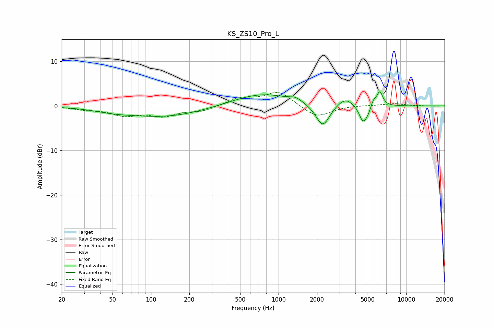

# KS_ZS10_Pro_L
See [usage instructions](https://github.com/jaakkopasanen/AutoEq#usage) for more options and info.

### Parametric EQs
Apply preamp of -3.3 dB when using parametric equalizer.

|   # | Type    |   Fc (Hz) |    Q |   Gain (dB) |
|-----|---------|-----------|------|-------------|
|   1 | Peaking |        51 | 0.88 |        -0.8 |
|   2 | Peaking |       133 | 0.48 |        -2.3 |
|   3 | Peaking |       738 | 0.63 |         2.8 |
|   4 | Peaking |      1365 | 2.94 |         0.9 |
|   5 | Peaking |      2220 | 2.6  |        -5.2 |
|   6 | Peaking |      3321 | 2.21 |         2   |
|   7 | Peaking |      4561 | 4.73 |        -3.1 |
|   8 | Peaking |      4976 | 4.09 |        -1.8 |
|   9 | Peaking |      5540 | 6    |         1.7 |
|  10 | Peaking |      6224 | 6    |         3.2 |

### Fixed Band EQs
When using fixed band (also called graphic) equalizer, apply preamp of **-3.1 dB** (if available) and set gains manually with these parameters.

|   # | Type    |   Fc (Hz) |    Q |   Gain (dB) |
|-----|---------|-----------|------|-------------|
|   1 | Peaking |        31 | 1.41 |        -0.6 |
|   2 | Peaking |        62 | 1.41 |        -1.9 |
|   3 | Peaking |       125 | 1.41 |        -2   |
|   4 | Peaking |       250 | 1.41 |        -1.1 |
|   5 | Peaking |       500 | 1.41 |         1.7 |
|   6 | Peaking |      1000 | 1.41 |         3.2 |
|   7 | Peaking |      2000 | 1.41 |        -2.7 |
|   8 | Peaking |      4000 | 1.41 |         0.1 |
|   9 | Peaking |      8000 | 1.41 |         0.5 |
|  10 | Peaking |     16000 | 1.41 |        -0   |

### Graphs

