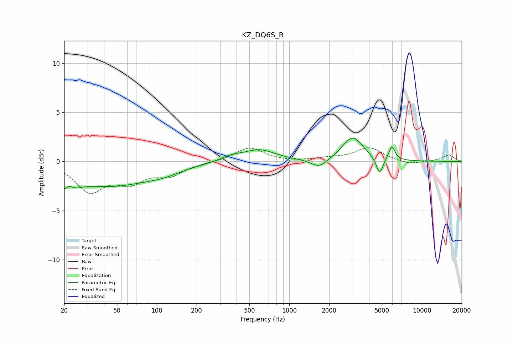

# KZ_DQ6S_R
See [usage instructions](https://github.com/jaakkopasanen/AutoEq#usage) for more options and info.

### Parametric EQs
Apply preamp of -2.5 dB when using parametric equalizer.

|   # | Type    |   Fc (Hz) |    Q |   Gain (dB) |
|-----|---------|-----------|------|-------------|
|   1 | Peaking |        21 | 2.49 |        -2.4 |
|   2 | Peaking |        22 | 4.42 |         1.4 |
|   3 | Peaking |        44 | 0.45 |        -2.4 |
|   4 | Peaking |       114 | 1.04 |        -0.5 |
|   5 | Peaking |       366 | 1.76 |         0.4 |
|   6 | Peaking |       596 | 1.18 |         1.2 |
|   7 | Peaking |      1679 | 2.37 |        -0.9 |
|   8 | Peaking |      3009 | 1.83 |         2.5 |
|   9 | Peaking |      4806 | 5.47 |        -1.7 |
|  10 | Peaking |      5944 | 6    |         1.4 |

### Fixed Band EQs
When using fixed band (also called graphic) equalizer, apply preamp of **-1.5 dB** (if available) and set gains manually with these parameters.

|   # | Type    |   Fc (Hz) |    Q |   Gain (dB) |
|-----|---------|-----------|------|-------------|
|   1 | Peaking |        31 | 1.41 |        -2.9 |
|   2 | Peaking |        62 | 1.41 |        -1.8 |
|   3 | Peaking |       125 | 1.41 |        -1.3 |
|   4 | Peaking |       250 | 1.41 |        -0   |
|   5 | Peaking |       500 | 1.41 |         1.4 |
|   6 | Peaking |      1000 | 1.41 |        -0.1 |
|   7 | Peaking |      2000 | 1.41 |         0.2 |
|   8 | Peaking |      4000 | 1.41 |         1.4 |
|   9 | Peaking |      8000 | 1.41 |        -0.4 |
|  10 | Peaking |     16000 | 1.41 |         0.7 |

### Graphs

