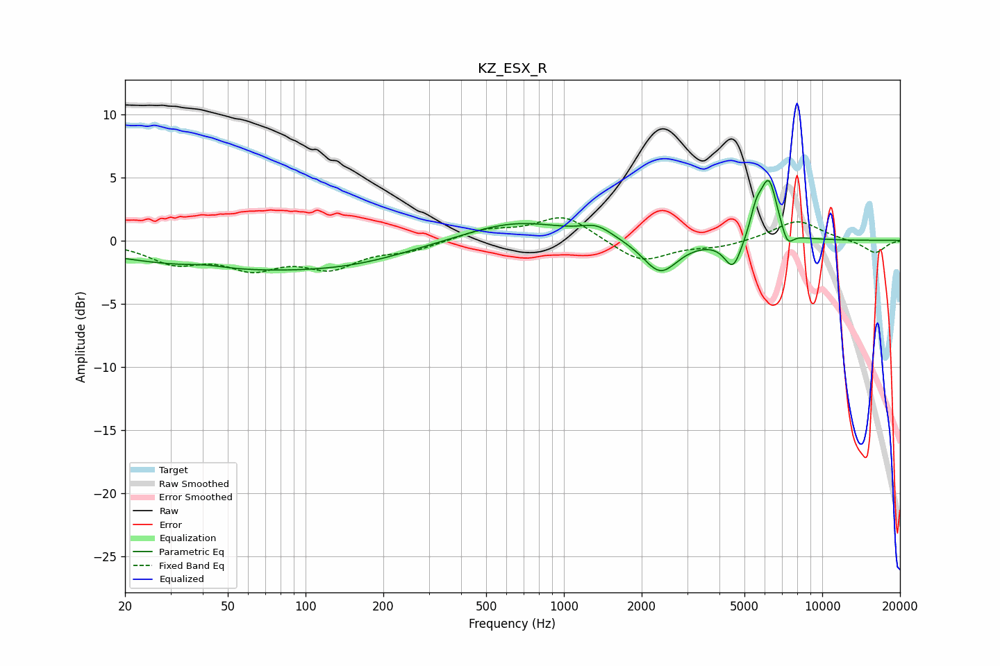

# KZ_ESX_R
See [usage instructions](https://github.com/jaakkopasanen/AutoEq#usage) for more options and info.

### Parametric EQs
Apply preamp of -4.8 dB when using parametric equalizer.

|   # | Type    |   Fc (Hz) |    Q |   Gain (dB) |
|-----|---------|-----------|------|-------------|
|   1 | Peaking |        41 | 1.89 |         0.3 |
|   2 | Peaking |        52 | 0.32 |        -2.1 |
|   3 | Peaking |       161 | 0.6  |        -0.8 |
|   4 | Peaking |       650 | 0.71 |         1.6 |
|   5 | Peaking |      1342 | 2.36 |         0.9 |
|   6 | Peaking |      2362 | 2.1  |        -2.7 |
|   7 | Peaking |      4517 | 4.18 |        -2.4 |
|   8 | Peaking |      5547 | 6    |         1.7 |
|   9 | Peaking |      6213 | 4.04 |         4.7 |
|  10 | Peaking |      7329 | 5.93 |        -1.3 |

### Fixed Band EQs
When using fixed band (also called graphic) equalizer, apply preamp of **-1.9 dB** (if available) and set gains manually with these parameters.

|   # | Type    |   Fc (Hz) |    Q |   Gain (dB) |
|-----|---------|-----------|------|-------------|
|   1 | Peaking |        31 | 1.41 |        -1.6 |
|   2 | Peaking |        62 | 1.41 |        -1.9 |
|   3 | Peaking |       125 | 1.41 |        -1.9 |
|   4 | Peaking |       250 | 1.41 |        -0.7 |
|   5 | Peaking |       500 | 1.41 |         0.8 |
|   6 | Peaking |      1000 | 1.41 |         2   |
|   7 | Peaking |      2000 | 1.41 |        -1.8 |
|   8 | Peaking |      4000 | 1.41 |        -0.5 |
|   9 | Peaking |      8000 | 1.41 |         1.6 |
|  10 | Peaking |     16000 | 1.41 |        -1   |

### Graphs

