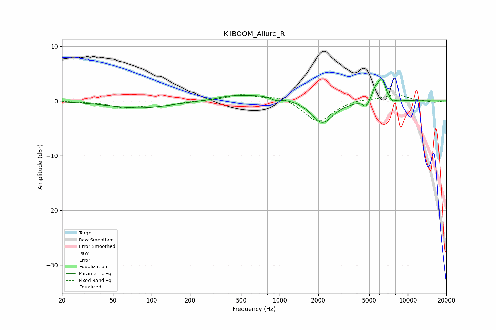

# KiiBOOM_Allure_R
See [usage instructions](https://github.com/jaakkopasanen/AutoEq#usage) for more options and info.

### Parametric EQs
Apply preamp of -4.1 dB when using parametric equalizer.

|   # | Type    |   Fc (Hz) |    Q |   Gain (dB) |
|-----|---------|-----------|------|-------------|
|   1 | Peaking |        81 | 0.59 |        -1.3 |
|   2 | Peaking |       399 | 2.16 |         0.3 |
|   3 | Peaking |       694 | 0.62 |         1.2 |
|   4 | Peaking |       938 | 3.57 |        -0.6 |
|   5 | Peaking |      2067 | 3.11 |        -0.3 |
|   6 | Peaking |      2165 | 1.65 |        -4   |
|   7 | Peaking |      4718 | 6    |        -1.3 |
|   8 | Peaking |      5550 | 6    |         1.2 |
|   9 | Peaking |      6244 | 4.01 |         4.1 |
|  10 | Peaking |      7527 | 5.31 |        -0.8 |

### Fixed Band EQs
When using fixed band (also called graphic) equalizer, apply preamp of **-1.3 dB** (if available) and set gains manually with these parameters.

|   # | Type    |   Fc (Hz) |    Q |   Gain (dB) |
|-----|---------|-----------|------|-------------|
|   1 | Peaking |        31 | 1.41 |        -0.1 |
|   2 | Peaking |        62 | 1.41 |        -1.2 |
|   3 | Peaking |       125 | 1.41 |        -0.7 |
|   4 | Peaking |       250 | 1.41 |         0   |
|   5 | Peaking |       500 | 1.41 |         1.2 |
|   6 | Peaking |      1000 | 1.41 |         0.9 |
|   7 | Peaking |      2000 | 1.41 |        -4   |
|   8 | Peaking |      4000 | 1.41 |         0.4 |
|   9 | Peaking |      8000 | 1.41 |         1.2 |
|  10 | Peaking |     16000 | 1.41 |        -0.3 |

### Graphs

