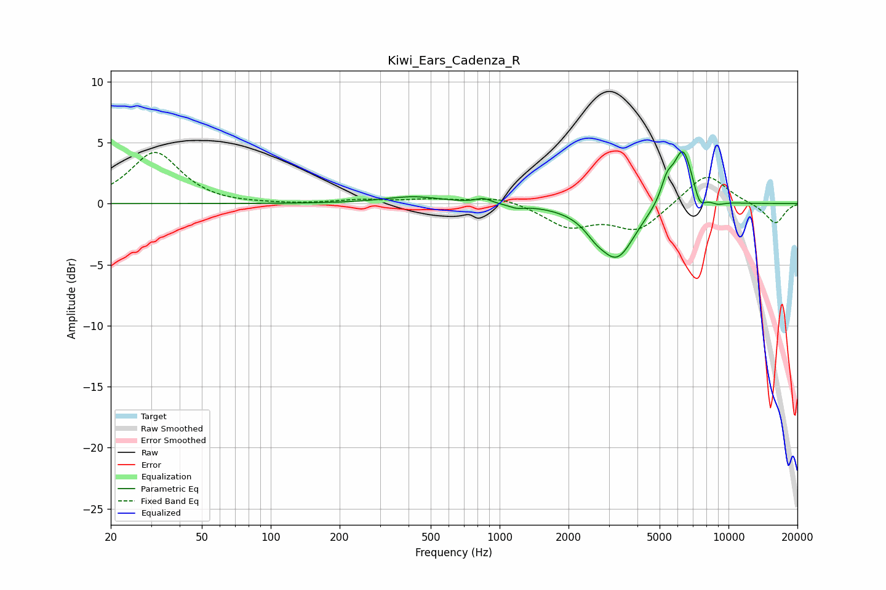

# Kiwi_Ears_Cadenza_R
See [usage instructions](https://github.com/jaakkopasanen/AutoEq#usage) for more options and info.

### Parametric EQs
Apply preamp of -4.3 dB when using parametric equalizer.

|   # | Type    |   Fc (Hz) |    Q |   Gain (dB) |
|-----|---------|-----------|------|-------------|
|   1 | Peaking |       420 | 1.12 |         0.6 |
|   2 | Peaking |       851 | 4.26 |         0.4 |
|   3 | Peaking |      1188 | 4.26 |        -0.3 |
|   4 | Peaking |      2255 | 1.88 |        -0.1 |
|   5 | Peaking |      2623 | 3.06 |        -0.8 |
|   6 | Peaking |      3264 | 1.79 |        -4.3 |
|   7 | Peaking |      5378 | 5.32 |         1.5 |
|   8 | Peaking |      6331 | 3.11 |         4.7 |
|   9 | Peaking |      7468 | 5.21 |        -1.4 |
|  10 | Peaking |      8946 | 4.15 |        -0.3 |

### Fixed Band EQs
When using fixed band (also called graphic) equalizer, apply preamp of **-4.3 dB** (if available) and set gains manually with these parameters.

|   # | Type    |   Fc (Hz) |    Q |   Gain (dB) |
|-----|---------|-----------|------|-------------|
|   1 | Peaking |        31 | 1.41 |         4.2 |
|   2 | Peaking |        62 | 1.41 |        -0.1 |
|   3 | Peaking |       125 | 1.41 |        -0.1 |
|   4 | Peaking |       250 | 1.41 |         0.3 |
|   5 | Peaking |       500 | 1.41 |         0.3 |
|   6 | Peaking |      1000 | 1.41 |         0.6 |
|   7 | Peaking |      2000 | 1.41 |        -1.8 |
|   8 | Peaking |      4000 | 1.41 |        -2.2 |
|   9 | Peaking |      8000 | 1.41 |         2.6 |
|  10 | Peaking |     16000 | 1.41 |        -1.7 |

### Graphs

