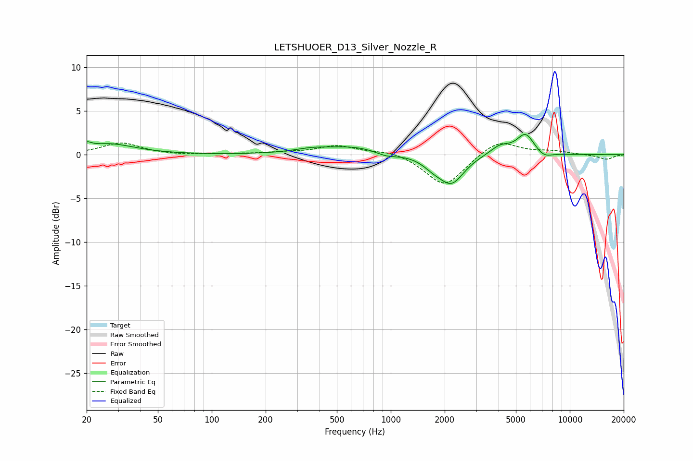

# LETSHUOER_D13_Silver_Nozzle_R
See [usage instructions](https://github.com/jaakkopasanen/AutoEq#usage) for more options and info.

### Parametric EQs
Apply preamp of -2.4 dB when using parametric equalizer.

|   # | Type    |   Fc (Hz) |    Q |   Gain (dB) |
|-----|---------|-----------|------|-------------|
|   1 | Peaking |        20 | 5.94 |         0.5 |
|   2 | Peaking |        27 | 0.99 |         1.2 |
|   3 | Peaking |       355 | 1.58 |         0.4 |
|   4 | Peaking |       616 | 0.81 |         0.9 |
|   5 | Peaking |       942 | 2.34 |        -0.5 |
|   6 | Peaking |      1731 | 2.38 |        -0.9 |
|   7 | Peaking |      2188 | 2.05 |        -3.1 |
|   8 | Peaking |      4087 | 2.4  |         1.1 |
|   9 | Peaking |      5657 | 2.84 |         2.3 |
|  10 | Peaking |      7176 | 3.04 |        -0.6 |

### Fixed Band EQs
When using fixed band (also called graphic) equalizer, apply preamp of **-1.4 dB** (if available) and set gains manually with these parameters.

|   # | Type    |   Fc (Hz) |    Q |   Gain (dB) |
|-----|---------|-----------|------|-------------|
|   1 | Peaking |        31 | 1.41 |         1.3 |
|   2 | Peaking |        62 | 1.41 |        -0.1 |
|   3 | Peaking |       125 | 1.41 |         0.1 |
|   4 | Peaking |       250 | 1.41 |         0.2 |
|   5 | Peaking |       500 | 1.41 |         1   |
|   6 | Peaking |      1000 | 1.41 |         0.5 |
|   7 | Peaking |      2000 | 1.41 |        -3.7 |
|   8 | Peaking |      4000 | 1.41 |         1.8 |
|   9 | Peaking |      8000 | 1.41 |         0.4 |
|  10 | Peaking |     16000 | 1.41 |        -0.5 |

### Graphs

