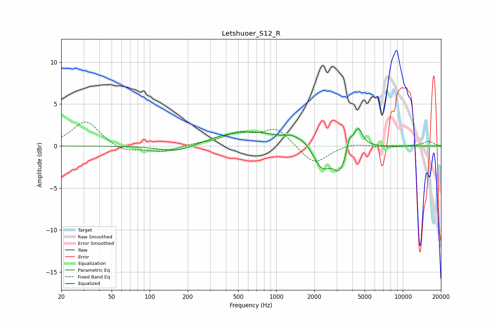

# Letshuoer_S12_R
See [usage instructions](https://github.com/jaakkopasanen/AutoEq#usage) for more options and info.

### Parametric EQs
Apply preamp of -2.2 dB when using parametric equalizer.

|   # | Type    |   Fc (Hz) |    Q |   Gain (dB) |
|-----|---------|-----------|------|-------------|
|   1 | Peaking |       156 | 1.04 |        -0.7 |
|   2 | Peaking |       187 | 1.22 |        -0.3 |
|   3 | Peaking |       593 | 0.51 |         1.8 |
|   4 | Peaking |      1302 | 3.58 |         0.3 |
|   5 | Peaking |      1700 | 1.65 |         1.1 |
|   6 | Peaking |      2287 | 1.76 |        -3.4 |
|   7 | Peaking |      3097 | 3.73 |        -2   |
|   8 | Peaking |      3440 | 6    |        -0.9 |
|   9 | Peaking |      3756 | 6    |         1.4 |
|  10 | Peaking |      4425 | 3.91 |         2.4 |

### Fixed Band EQs
When using fixed band (also called graphic) equalizer, apply preamp of **-3.0 dB** (if available) and set gains manually with these parameters.

|   # | Type    |   Fc (Hz) |    Q |   Gain (dB) |
|-----|---------|-----------|------|-------------|
|   1 | Peaking |        31 | 1.41 |         3   |
|   2 | Peaking |        62 | 1.41 |        -0.8 |
|   3 | Peaking |       125 | 1.41 |        -0.7 |
|   4 | Peaking |       250 | 1.41 |         0.3 |
|   5 | Peaking |       500 | 1.41 |         1.4 |
|   6 | Peaking |      1000 | 1.41 |         2.1 |
|   7 | Peaking |      2000 | 1.41 |        -2.3 |
|   8 | Peaking |      4000 | 1.41 |         0.4 |
|   9 | Peaking |      8000 | 1.41 |        -0.1 |
|  10 | Peaking |     16000 | 1.41 |         0.6 |

### Graphs

