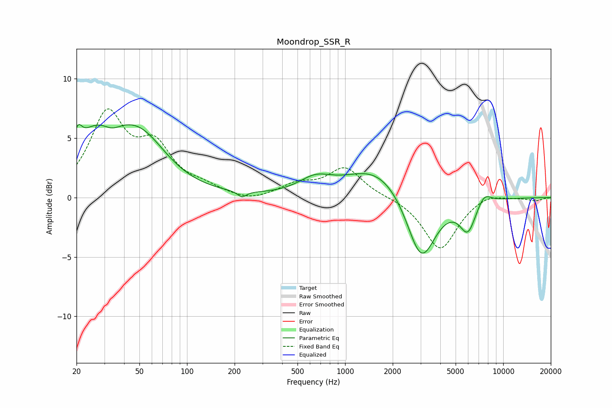

# Moondrop_SSR_R
See [usage instructions](https://github.com/jaakkopasanen/AutoEq#usage) for more options and info.

### Parametric EQs
Apply preamp of -6.3 dB when using parametric equalizer.

|   # | Type    |   Fc (Hz) |    Q |   Gain (dB) |
|-----|---------|-----------|------|-------------|
|   1 | Peaking |        20 | 5.84 |         1.5 |
|   2 | Peaking |        28 | 0.83 |         5   |
|   3 | Peaking |        33 | 2.26 |        -1   |
|   4 | Peaking |        52 | 0.86 |         3.8 |
|   5 | Peaking |       223 | 5.18 |        -0.5 |
|   6 | Peaking |       648 | 1.36 |         1.2 |
|   7 | Peaking |      1606 | 0.72 |         2.6 |
|   8 | Peaking |      3028 | 1.55 |        -5.9 |
|   9 | Peaking |      5974 | 2.69 |        -2.6 |
|  10 | Peaking |      7561 | 3.01 |         1   |

### Fixed Band EQs
When using fixed band (also called graphic) equalizer, apply preamp of **-7.6 dB** (if available) and set gains manually with these parameters.

|   # | Type    |   Fc (Hz) |    Q |   Gain (dB) |
|-----|---------|-----------|------|-------------|
|   1 | Peaking |        31 | 1.41 |         6.7 |
|   2 | Peaking |        62 | 1.41 |         3.8 |
|   3 | Peaking |       125 | 1.41 |         0.7 |
|   4 | Peaking |       250 | 1.41 |        -0.4 |
|   5 | Peaking |       500 | 1.41 |         1   |
|   6 | Peaking |      1000 | 1.41 |         2.5 |
|   7 | Peaking |      2000 | 1.41 |         0   |
|   8 | Peaking |      4000 | 1.41 |        -4.4 |
|   9 | Peaking |      8000 | 1.41 |         0.5 |
|  10 | Peaking |     16000 | 1.41 |        -0.3 |

### Graphs

