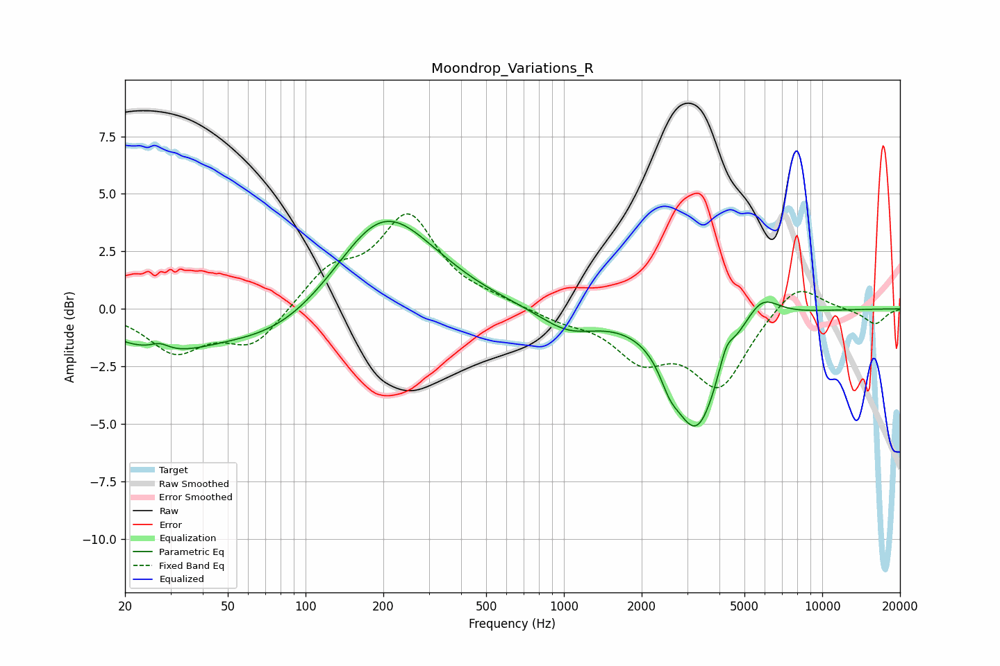

# Moondrop_Variations_R
See [usage instructions](https://github.com/jaakkopasanen/AutoEq#usage) for more options and info.

### Parametric EQs
Apply preamp of -3.9 dB when using parametric equalizer.

|   # | Type    |   Fc (Hz) |    Q |   Gain (dB) |
|-----|---------|-----------|------|-------------|
|   1 | Peaking |        27 | 3.78 |         0.3 |
|   2 | Peaking |        28 | 0.7  |        -1.6 |
|   3 | Peaking |        79 | 0.65 |        -1.3 |
|   4 | Peaking |       196 | 0.81 |         3.8 |
|   5 | Peaking |       278 | 0.74 |         0.7 |
|   6 | Peaking |      1037 | 1.25 |        -0.9 |
|   7 | Peaking |      2564 | 3.8  |        -0.8 |
|   8 | Peaking |      3264 | 1.57 |        -5.1 |
|   9 | Peaking |      4248 | 5.12 |         0.8 |
|  10 | Peaking |      5797 | 2.04 |         1.2 |

### Fixed Band EQs
When using fixed band (also called graphic) equalizer, apply preamp of **-4.2 dB** (if available) and set gains manually with these parameters.

|   # | Type    |   Fc (Hz) |    Q |   Gain (dB) |
|-----|---------|-----------|------|-------------|
|   1 | Peaking |        31 | 1.41 |        -1.8 |
|   2 | Peaking |        62 | 1.41 |        -1.6 |
|   3 | Peaking |       125 | 1.41 |         1.6 |
|   4 | Peaking |       250 | 1.41 |         3.9 |
|   5 | Peaking |       500 | 1.41 |         0.3 |
|   6 | Peaking |      1000 | 1.41 |        -0.4 |
|   7 | Peaking |      2000 | 1.41 |        -1.9 |
|   8 | Peaking |      4000 | 1.41 |        -3.2 |
|   9 | Peaking |      8000 | 1.41 |         1.3 |
|  10 | Peaking |     16000 | 1.41 |        -0.7 |

### Graphs

