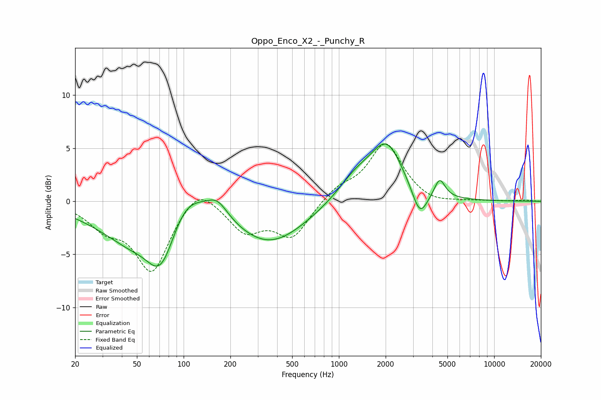

# Oppo_Enco_X2_-_Punchy_R
See [usage instructions](https://github.com/jaakkopasanen/AutoEq#usage) for more options and info.

### Parametric EQs
Apply preamp of -5.5 dB when using parametric equalizer.

|   # | Type    |   Fc (Hz) |    Q |   Gain (dB) |
|-----|---------|-----------|------|-------------|
|   1 | Peaking |        37 | 0.63 |        -2.1 |
|   2 | Peaking |        45 | 1.22 |        -1   |
|   3 | Peaking |        72 | 1.4  |        -6   |
|   4 | Peaking |       101 | 1.12 |         3.2 |
|   5 | Peaking |       165 | 2.08 |         1.6 |
|   6 | Peaking |       357 | 0.61 |        -4   |
|   7 | Peaking |      1277 | 1.17 |         2   |
|   8 | Peaking |      2033 | 1.34 |         5   |
|   9 | Peaking |      3323 | 2.85 |        -2.7 |
|  10 | Peaking |      4458 | 4.09 |         1.8 |

### Fixed Band EQs
When using fixed band (also called graphic) equalizer, apply preamp of **-5.5 dB** (if available) and set gains manually with these parameters.

|   # | Type    |   Fc (Hz) |    Q |   Gain (dB) |
|-----|---------|-----------|------|-------------|
|   1 | Peaking |        31 | 1.41 |        -2.1 |
|   2 | Peaking |        62 | 1.41 |        -6.5 |
|   3 | Peaking |       125 | 1.41 |         2   |
|   4 | Peaking |       250 | 1.41 |        -2.7 |
|   5 | Peaking |       500 | 1.41 |        -3.3 |
|   6 | Peaking |      1000 | 1.41 |         1.2 |
|   7 | Peaking |      2000 | 1.41 |         5.4 |
|   8 | Peaking |      4000 | 1.41 |        -0.4 |
|   9 | Peaking |      8000 | 1.41 |         0   |
|  10 | Peaking |     16000 | 1.41 |         0.1 |

### Graphs

