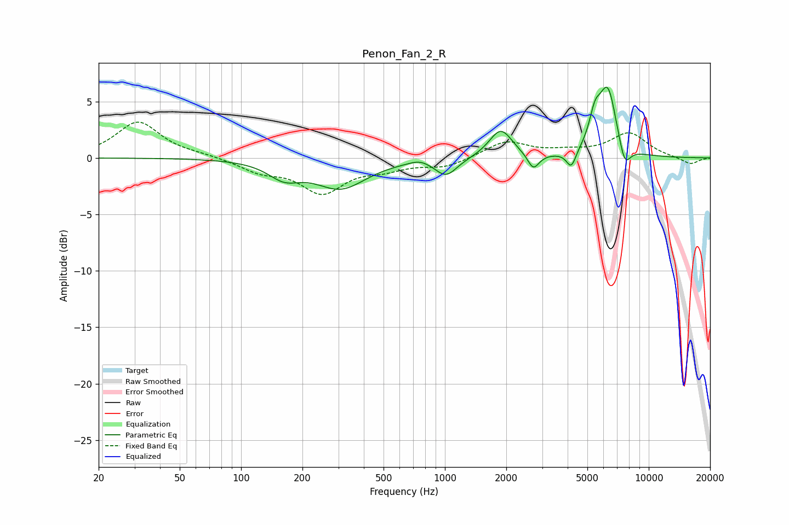

# Penon_Fan_2_R
See [usage instructions](https://github.com/jaakkopasanen/AutoEq#usage) for more options and info.

### Parametric EQs
Apply preamp of -6.4 dB when using parametric equalizer.

|   # | Type    |   Fc (Hz) |    Q |   Gain (dB) |
|-----|---------|-----------|------|-------------|
|   1 | Peaking |       163 | 1.79 |        -1.4 |
|   2 | Peaking |       308 | 1.13 |        -2.6 |
|   3 | Peaking |       752 | 2.83 |         0.4 |
|   4 | Peaking |      1013 | 2.63 |        -1.6 |
|   5 | Peaking |      1879 | 2.5  |         2.5 |
|   6 | Peaking |      2715 | 5.06 |        -1.4 |
|   7 | Peaking |      4171 | 6    |        -1.5 |
|   8 | Peaking |      5444 | 4.98 |         2.3 |
|   9 | Peaking |      6294 | 3.08 |         6   |
|  10 | Peaking |      7612 | 4.61 |        -2.2 |

### Fixed Band EQs
When using fixed band (also called graphic) equalizer, apply preamp of **-3.3 dB** (if available) and set gains manually with these parameters.

|   # | Type    |   Fc (Hz) |    Q |   Gain (dB) |
|-----|---------|-----------|------|-------------|
|   1 | Peaking |        31 | 1.41 |         3.2 |
|   2 | Peaking |        62 | 1.41 |         0.2 |
|   3 | Peaking |       125 | 1.41 |        -1.1 |
|   4 | Peaking |       250 | 1.41 |        -2.9 |
|   5 | Peaking |       500 | 1.41 |        -0.8 |
|   6 | Peaking |      1000 | 1.41 |        -0.8 |
|   7 | Peaking |      2000 | 1.41 |         1.5 |
|   8 | Peaking |      4000 | 1.41 |         0.4 |
|   9 | Peaking |      8000 | 1.41 |         2.2 |
|  10 | Peaking |     16000 | 1.41 |        -0.6 |

### Graphs

