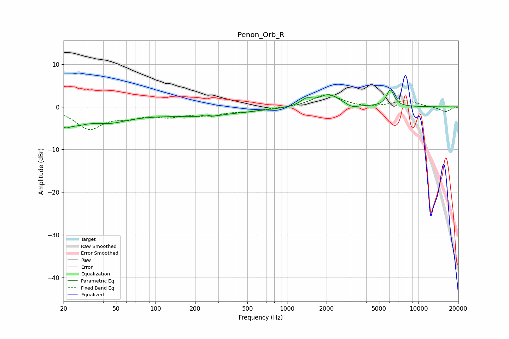

# Penon_Orb_R
See [usage instructions](https://github.com/jaakkopasanen/AutoEq#usage) for more options and info.

### Parametric EQs
Apply preamp of -4.1 dB when using parametric equalizer.

|   # | Type    |   Fc (Hz) |    Q |   Gain (dB) |
|-----|---------|-----------|------|-------------|
|   1 | Peaking |        20 | 4.21 |        -1.8 |
|   2 | Peaking |        24 | 1.41 |        -2.7 |
|   3 | Peaking |        45 | 1.05 |        -2.1 |
|   4 | Peaking |       156 | 0.27 |        -1.9 |
|   5 | Peaking |       239 | 3.29 |         1.9 |
|   6 | Peaking |       242 | 2.41 |        -1.9 |
|   7 | Peaking |      1400 | 3.2  |         1.5 |
|   8 | Peaking |      2088 | 1.81 |         2.9 |
|   9 | Peaking |      3127 | 3.26 |        -0.8 |
|  10 | Peaking |      6107 | 4.81 |         3.9 |

### Fixed Band EQs
When using fixed band (also called graphic) equalizer, apply preamp of **-2.9 dB** (if available) and set gains manually with these parameters.

|   # | Type    |   Fc (Hz) |    Q |   Gain (dB) |
|-----|---------|-----------|------|-------------|
|   1 | Peaking |        31 | 1.41 |        -4.9 |
|   2 | Peaking |        62 | 1.41 |        -1.9 |
|   3 | Peaking |       125 | 1.41 |        -1.8 |
|   4 | Peaking |       250 | 1.41 |        -1.8 |
|   5 | Peaking |       500 | 1.41 |        -0.9 |
|   6 | Peaking |      1000 | 1.41 |        -0.2 |
|   7 | Peaking |      2000 | 1.41 |         2.9 |
|   8 | Peaking |      4000 | 1.41 |        -0.3 |
|   9 | Peaking |      8000 | 1.41 |         1.5 |
|  10 | Peaking |     16000 | 1.41 |        -1.2 |

### Graphs

