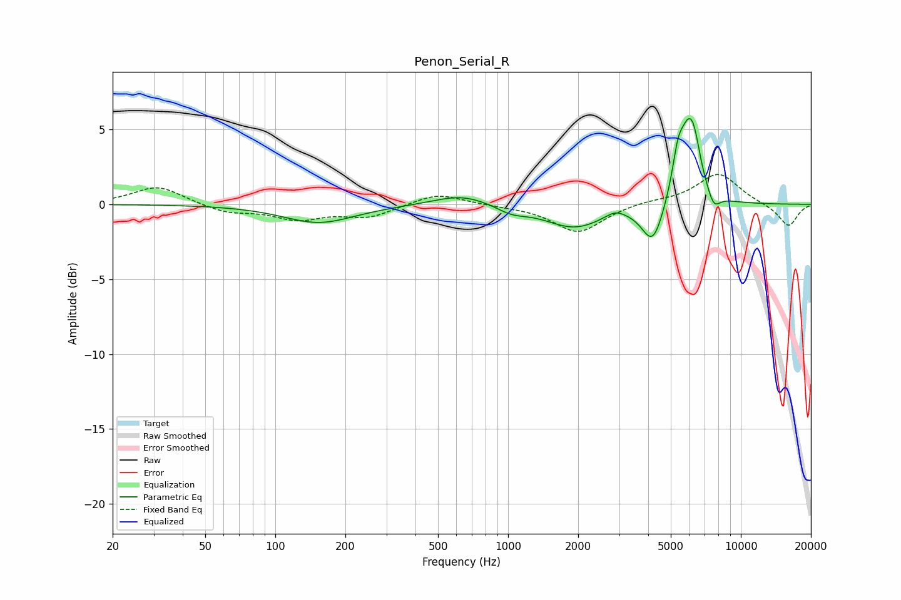

# Penon_Serial_R
See [usage instructions](https://github.com/jaakkopasanen/AutoEq#usage) for more options and info.

### Parametric EQs
Apply preamp of -5.8 dB when using parametric equalizer.

|   # | Type    |   Fc (Hz) |    Q |   Gain (dB) |
|-----|---------|-----------|------|-------------|
|   1 | Peaking |       154 | 0.92 |        -1.2 |
|   2 | Peaking |       635 | 1.17 |         0.7 |
|   3 | Peaking |      1034 | 2.19 |        -0.5 |
|   4 | Peaking |      1924 | 1.12 |        -1.5 |
|   5 | Peaking |      2887 | 3.48 |         0.4 |
|   6 | Peaking |      4189 | 2.98 |        -2.8 |
|   7 | Peaking |      5362 | 5.99 |         1.9 |
|   8 | Peaking |      5977 | 3.06 |         5.1 |
|   9 | Peaking |      6315 | 6    |         1   |
|  10 | Peaking |      7645 | 4.81 |        -1.1 |

### Fixed Band EQs
When using fixed band (also called graphic) equalizer, apply preamp of **-2.1 dB** (if available) and set gains manually with these parameters.

|   # | Type    |   Fc (Hz) |    Q |   Gain (dB) |
|-----|---------|-----------|------|-------------|
|   1 | Peaking |        31 | 1.41 |         1.2 |
|   2 | Peaking |        62 | 1.41 |        -0.5 |
|   3 | Peaking |       125 | 1.41 |        -0.9 |
|   4 | Peaking |       250 | 1.41 |        -0.8 |
|   5 | Peaking |       500 | 1.41 |         0.8 |
|   6 | Peaking |      1000 | 1.41 |        -0.1 |
|   7 | Peaking |      2000 | 1.41 |        -1.9 |
|   8 | Peaking |      4000 | 1.41 |         0.2 |
|   9 | Peaking |      8000 | 1.41 |         2.1 |
|  10 | Peaking |     16000 | 1.41 |        -1.5 |

### Graphs

