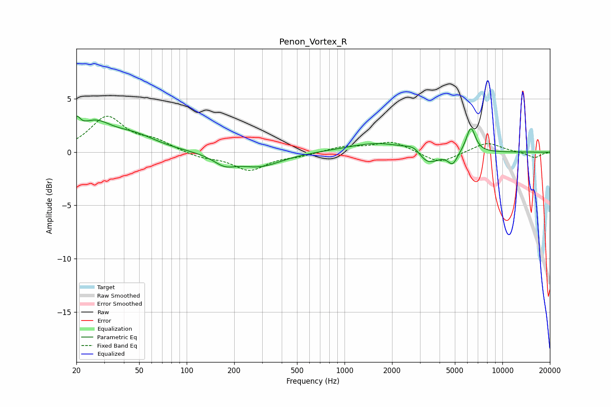

# Penon_Vortex_R
See [usage instructions](https://github.com/jaakkopasanen/AutoEq#usage) for more options and info.

### Parametric EQs
Apply preamp of -3.5 dB when using parametric equalizer.

|   # | Type    |   Fc (Hz) |    Q |   Gain (dB) |
|-----|---------|-----------|------|-------------|
|   1 | Peaking |        20 | 5.92 |         1.5 |
|   2 | Peaking |        26 | 1.32 |         2.3 |
|   3 | Peaking |        46 | 0.96 |         1.3 |
|   4 | Peaking |       174 | 1.98 |        -0.9 |
|   5 | Peaking |       290 | 1.02 |        -1.3 |
|   6 | Peaking |      1642 | 0.74 |         0.9 |
|   7 | Peaking |      2790 | 2.66 |         0.8 |
|   8 | Peaking |      3315 | 1.96 |        -1.6 |
|   9 | Peaking |      4842 | 4.63 |        -1.1 |
|  10 | Peaking |      6312 | 4.73 |         2.4 |

### Fixed Band EQs
When using fixed band (also called graphic) equalizer, apply preamp of **-3.5 dB** (if available) and set gains manually with these parameters.

|   # | Type    |   Fc (Hz) |    Q |   Gain (dB) |
|-----|---------|-----------|------|-------------|
|   1 | Peaking |        31 | 1.41 |         3.2 |
|   2 | Peaking |        62 | 1.41 |         0.9 |
|   3 | Peaking |       125 | 1.41 |        -0.5 |
|   4 | Peaking |       250 | 1.41 |        -1.6 |
|   5 | Peaking |       500 | 1.41 |        -0.3 |
|   6 | Peaking |      1000 | 1.41 |         0.5 |
|   7 | Peaking |      2000 | 1.41 |         1   |
|   8 | Peaking |      4000 | 1.41 |        -1.1 |
|   9 | Peaking |      8000 | 1.41 |         0.9 |
|  10 | Peaking |     16000 | 1.41 |        -0.5 |

### Graphs

