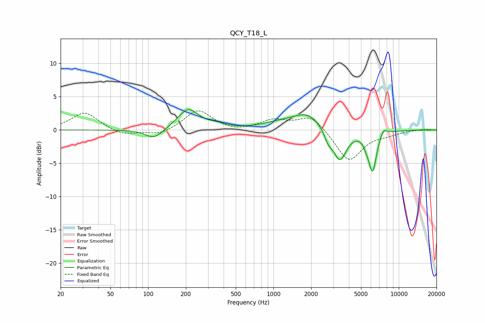

# QCY_T18_L
See [usage instructions](https://github.com/jaakkopasanen/AutoEq#usage) for more options and info.

### Parametric EQs
Apply preamp of -3.1 dB when using parametric equalizer.

|   # | Type    |   Fc (Hz) |    Q |   Gain (dB) |
|-----|---------|-----------|------|-------------|
|   1 | Peaking |       111 | 2.04 |        -1.5 |
|   2 | Peaking |       209 | 1.7  |         3.1 |
|   3 | Peaking |       355 | 1.94 |         0.5 |
|   4 | Peaking |      1057 | 1.15 |         0.7 |
|   5 | Peaking |      1856 | 1.18 |         2.5 |
|   6 | Peaking |      2728 | 4.63 |        -1.4 |
|   7 | Peaking |      3376 | 2.58 |        -4.8 |
|   8 | Peaking |      5517 | 5.99 |        -0.8 |
|   9 | Peaking |      6181 | 4.29 |        -5.9 |
|  10 | Peaking |      7546 | 4.93 |         1.1 |

### Fixed Band EQs
When using fixed band (also called graphic) equalizer, apply preamp of **-3.0 dB** (if available) and set gains manually with these parameters.

|   # | Type    |   Fc (Hz) |    Q |   Gain (dB) |
|-----|---------|-----------|------|-------------|
|   1 | Peaking |        31 | 1.41 |         2.7 |
|   2 | Peaking |        62 | 1.41 |        -0.9 |
|   3 | Peaking |       125 | 1.41 |        -0.8 |
|   4 | Peaking |       250 | 1.41 |         3   |
|   5 | Peaking |       500 | 1.41 |        -0.4 |
|   6 | Peaking |      1000 | 1.41 |         1.4 |
|   7 | Peaking |      2000 | 1.41 |         2.2 |
|   8 | Peaking |      4000 | 1.41 |        -4.7 |
|   9 | Peaking |      8000 | 1.41 |        -0.5 |
|  10 | Peaking |     16000 | 1.41 |         0.2 |

### Graphs

