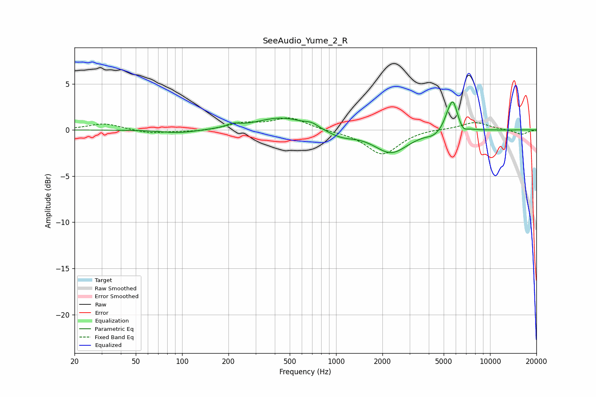

# SeeAudio_Yume_2_R
See [usage instructions](https://github.com/jaakkopasanen/AutoEq#usage) for more options and info.

### Parametric EQs
Apply preamp of -3.1 dB when using parametric equalizer.

|   # | Type    |   Fc (Hz) |    Q |   Gain (dB) |
|-----|---------|-----------|------|-------------|
|   1 | Peaking |        95 | 1.25 |        -0.4 |
|   2 | Peaking |       214 | 3.52 |         0.4 |
|   3 | Peaking |       441 | 0.9  |         1.4 |
|   4 | Peaking |       695 | 3.31 |         0.4 |
|   5 | Peaking |      1076 | 1.55 |        -0.7 |
|   6 | Peaking |      2278 | 1.29 |        -2.4 |
|   7 | Peaking |      4274 | 3.47 |        -0.4 |
|   8 | Peaking |      5244 | 6    |         0.6 |
|   9 | Peaking |      5731 | 4.55 |         3.2 |
|  10 | Peaking |      6700 | 6    |        -0.5 |

### Fixed Band EQs
When using fixed band (also called graphic) equalizer, apply preamp of **-1.4 dB** (if available) and set gains manually with these parameters.

|   # | Type    |   Fc (Hz) |    Q |   Gain (dB) |
|-----|---------|-----------|------|-------------|
|   1 | Peaking |        31 | 1.41 |         0.7 |
|   2 | Peaking |        62 | 1.41 |        -0.4 |
|   3 | Peaking |       125 | 1.41 |        -0.2 |
|   4 | Peaking |       250 | 1.41 |         0.7 |
|   5 | Peaking |       500 | 1.41 |         1.3 |
|   6 | Peaking |      1000 | 1.41 |        -0.1 |
|   7 | Peaking |      2000 | 1.41 |        -2.7 |
|   8 | Peaking |      4000 | 1.41 |         0.1 |
|   9 | Peaking |      8000 | 1.41 |         0.9 |
|  10 | Peaking |     16000 | 1.41 |        -0.5 |

### Graphs

