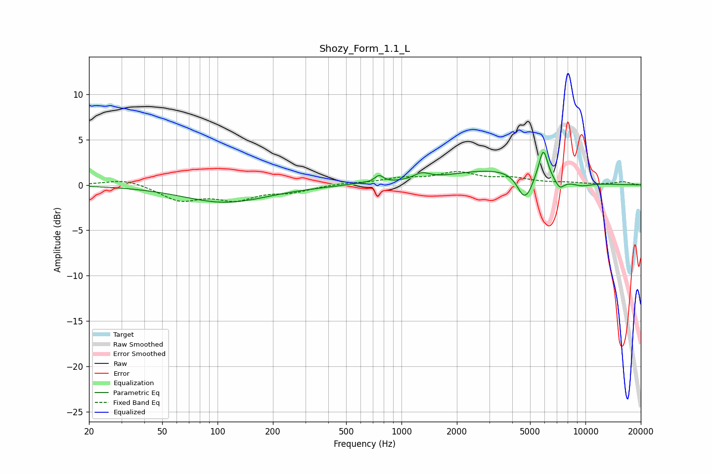

# Shozy_Form_1.1_L
See [usage instructions](https://github.com/jaakkopasanen/AutoEq#usage) for more options and info.

### Parametric EQs
Apply preamp of -3.7 dB when using parametric equalizer.

|   # | Type    |   Fc (Hz) |    Q |   Gain (dB) |
|-----|---------|-----------|------|-------------|
|   1 | Peaking |       110 | 0.61 |        -1.9 |
|   2 | Peaking |       578 | 2.23 |         0.1 |
|   3 | Peaking |       755 | 6    |         0.8 |
|   4 | Peaking |      1287 | 3.33 |         0.7 |
|   5 | Peaking |      3261 | 0.57 |         1.7 |
|   6 | Peaking |      4602 | 3.88 |        -2.3 |
|   7 | Peaking |      4955 | 5.06 |        -0.8 |
|   8 | Peaking |      5904 | 5.73 |         3.3 |
|   9 | Peaking |      7240 | 5.26 |        -1   |
|  10 | Peaking |      9494 | 2.24 |        -0.4 |

### Fixed Band EQs
When using fixed band (also called graphic) equalizer, apply preamp of **-1.6 dB** (if available) and set gains manually with these parameters.

|   # | Type    |   Fc (Hz) |    Q |   Gain (dB) |
|-----|---------|-----------|------|-------------|
|   1 | Peaking |        31 | 1.41 |         0.7 |
|   2 | Peaking |        62 | 1.41 |        -1.6 |
|   3 | Peaking |       125 | 1.41 |        -1.4 |
|   4 | Peaking |       250 | 1.41 |        -0.7 |
|   5 | Peaking |       500 | 1.41 |         0.2 |
|   6 | Peaking |      1000 | 1.41 |         0.6 |
|   7 | Peaking |      2000 | 1.41 |         1.3 |
|   8 | Peaking |      4000 | 1.41 |         0.6 |
|   9 | Peaking |      8000 | 1.41 |         0.2 |
|  10 | Peaking |     16000 | 1.41 |         0.3 |

### Graphs

