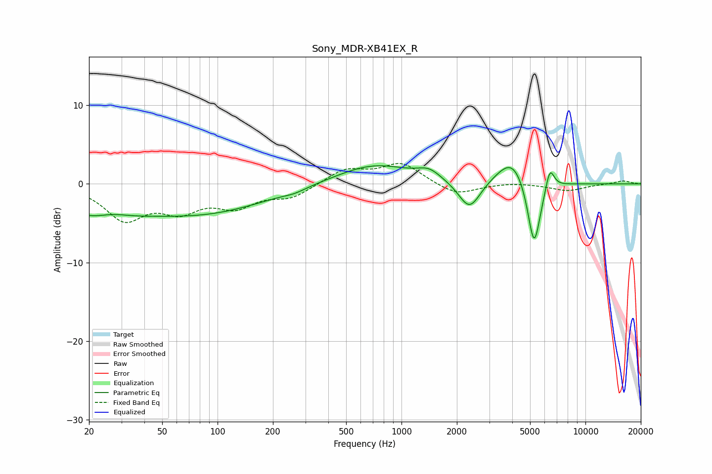

# Sony_MDR-XB41EX_R
See [usage instructions](https://github.com/jaakkopasanen/AutoEq#usage) for more options and info.

### Parametric EQs
Apply preamp of -2.4 dB when using parametric equalizer.

|   # | Type    |   Fc (Hz) |    Q |   Gain (dB) |
|-----|---------|-----------|------|-------------|
|   1 | Peaking |        22 | 0.72 |        -3.6 |
|   2 | Peaking |        26 | 1.52 |         1.1 |
|   3 | Peaking |        82 | 0.4  |        -3.5 |
|   4 | Peaking |       263 | 2.51 |        -0.3 |
|   5 | Peaking |       706 | 0.69 |         2.5 |
|   6 | Peaking |      1411 | 2.31 |         1.2 |
|   7 | Peaking |      2343 | 2.35 |        -3.8 |
|   8 | Peaking |      4040 | 1.65 |         3.8 |
|   9 | Peaking |      5257 | 3.76 |        -9.2 |
|  10 | Peaking |      6402 | 5.73 |         3   |

### Fixed Band EQs
When using fixed band (also called graphic) equalizer, apply preamp of **-2.7 dB** (if available) and set gains manually with these parameters.

|   # | Type    |   Fc (Hz) |    Q |   Gain (dB) |
|-----|---------|-----------|------|-------------|
|   1 | Peaking |        31 | 1.41 |        -4.3 |
|   2 | Peaking |        62 | 1.41 |        -2.9 |
|   3 | Peaking |       125 | 1.41 |        -2.5 |
|   4 | Peaking |       250 | 1.41 |        -1.6 |
|   5 | Peaking |       500 | 1.41 |         1.9 |
|   6 | Peaking |      1000 | 1.41 |         2.6 |
|   7 | Peaking |      2000 | 1.41 |        -1.5 |
|   8 | Peaking |      4000 | 1.41 |         0.2 |
|   9 | Peaking |      8000 | 1.41 |        -0.9 |
|  10 | Peaking |     16000 | 1.41 |         0.4 |

### Graphs

