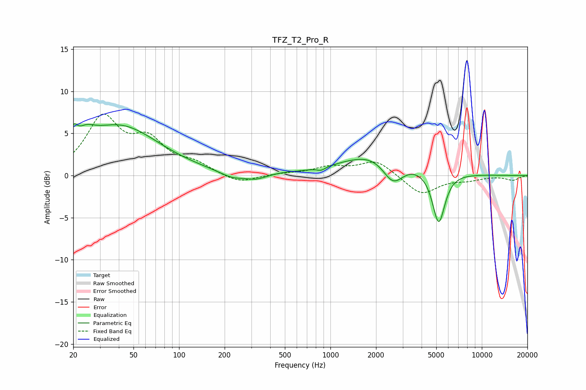

# TFZ_T2_Pro_R
See [usage instructions](https://github.com/jaakkopasanen/AutoEq#usage) for more options and info.

### Parametric EQs
Apply preamp of -6.3 dB when using parametric equalizer.

|   # | Type    |   Fc (Hz) |    Q |   Gain (dB) |
|-----|---------|-----------|------|-------------|
|   1 | Peaking |        20 | 5.92 |         1.8 |
|   2 | Peaking |        24 | 2.4  |         1.4 |
|   3 | Peaking |        40 | 0.54 |         5.8 |
|   4 | Peaking |       226 | 1.65 |        -0.8 |
|   5 | Peaking |       324 | 2.16 |        -0.6 |
|   6 | Peaking |       505 | 2.32 |         0.1 |
|   7 | Peaking |       868 | 5.22 |        -0.4 |
|   8 | Peaking |      2149 | 0.62 |         3   |
|   9 | Peaking |      2590 | 1.95 |        -3.2 |
|  10 | Peaking |      5189 | 3.35 |        -6.3 |

### Fixed Band EQs
When using fixed band (also called graphic) equalizer, apply preamp of **-7.4 dB** (if available) and set gains manually with these parameters.

|   # | Type    |   Fc (Hz) |    Q |   Gain (dB) |
|-----|---------|-----------|------|-------------|
|   1 | Peaking |        31 | 1.41 |         6.6 |
|   2 | Peaking |        62 | 1.41 |         3.6 |
|   3 | Peaking |       125 | 1.41 |         1.2 |
|   4 | Peaking |       250 | 1.41 |        -1   |
|   5 | Peaking |       500 | 1.41 |         0.2 |
|   6 | Peaking |      1000 | 1.41 |         0.9 |
|   7 | Peaking |      2000 | 1.41 |         1.8 |
|   8 | Peaking |      4000 | 1.41 |        -2.3 |
|   9 | Peaking |      8000 | 1.41 |        -0.4 |
|  10 | Peaking |     16000 | 1.41 |        -0.5 |

### Graphs

