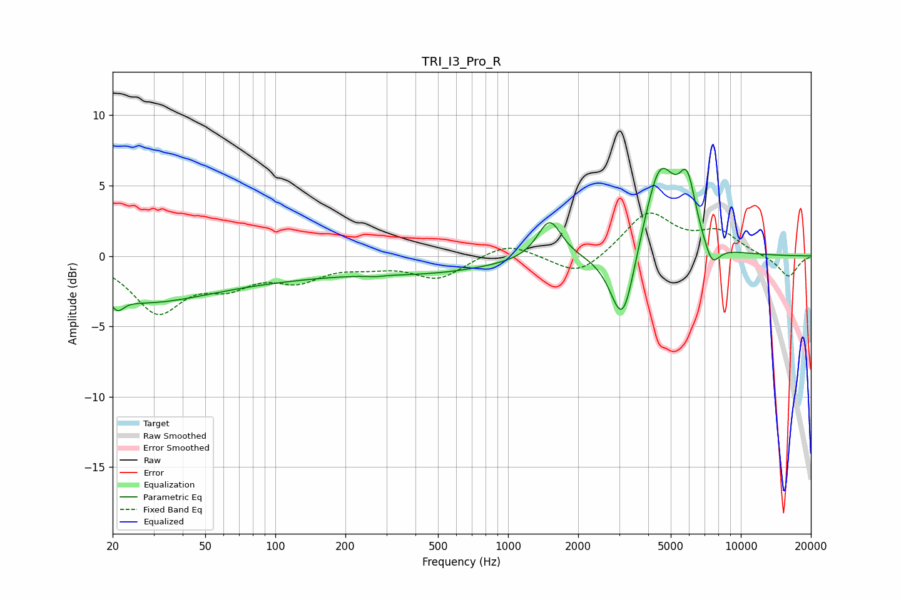

# TRI_I3_Pro_R
See [usage instructions](https://github.com/jaakkopasanen/AutoEq#usage) for more options and info.

### Parametric EQs
Apply preamp of -6.3 dB when using parametric equalizer.

|   # | Type    |   Fc (Hz) |    Q |   Gain (dB) |
|-----|---------|-----------|------|-------------|
|   1 | Peaking |        21 | 5.64 |        -0.8 |
|   2 | Peaking |        25 | 0.49 |        -2.9 |
|   3 | Peaking |        98 | 0.39 |        -1.1 |
|   4 | Peaking |       268 | 4.04 |        -0.1 |
|   5 | Peaking |       490 | 0.51 |        -1   |
|   6 | Peaking |      1508 | 2.76 |         2.8 |
|   7 | Peaking |      3108 | 2.65 |        -5.8 |
|   8 | Peaking |      4484 | 2    |         6.6 |
|   9 | Peaking |      5884 | 3.75 |         4   |
|  10 | Peaking |      7509 | 3.92 |        -1.7 |

### Fixed Band EQs
When using fixed band (also called graphic) equalizer, apply preamp of **-3.1 dB** (if available) and set gains manually with these parameters.

|   # | Type    |   Fc (Hz) |    Q |   Gain (dB) |
|-----|---------|-----------|------|-------------|
|   1 | Peaking |        31 | 1.41 |        -3.8 |
|   2 | Peaking |        62 | 1.41 |        -1.7 |
|   3 | Peaking |       125 | 1.41 |        -1.5 |
|   4 | Peaking |       250 | 1.41 |        -0.5 |
|   5 | Peaking |       500 | 1.41 |        -1.6 |
|   6 | Peaking |      1000 | 1.41 |         1   |
|   7 | Peaking |      2000 | 1.41 |        -1.6 |
|   8 | Peaking |      4000 | 1.41 |         3.1 |
|   9 | Peaking |      8000 | 1.41 |         1.6 |
|  10 | Peaking |     16000 | 1.41 |        -1.5 |

### Graphs

