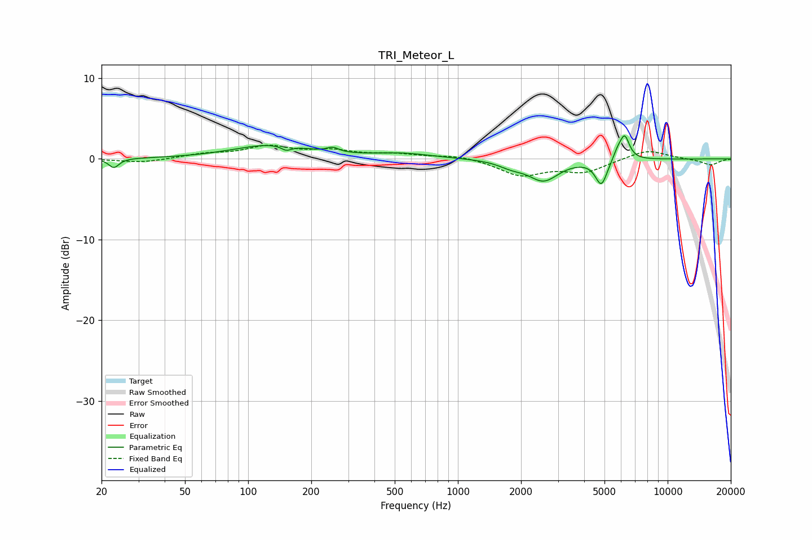

# TRI_Meteor_L
See [usage instructions](https://github.com/jaakkopasanen/AutoEq#usage) for more options and info.

### Parametric EQs
Apply preamp of -3.0 dB when using parametric equalizer.

|   # | Type    |   Fc (Hz) |    Q |   Gain (dB) |
|-----|---------|-----------|------|-------------|
|   1 | Peaking |        23 | 5.88 |        -1.2 |
|   2 | Peaking |       129 | 0.78 |         1.7 |
|   3 | Peaking |       152 | 6    |        -0.6 |
|   4 | Peaking |       253 | 5.05 |         0.6 |
|   5 | Peaking |       542 | 0.98 |         0.6 |
|   6 | Peaking |      1801 | 2.31 |        -0.7 |
|   7 | Peaking |      2563 | 1.98 |        -2.6 |
|   8 | Peaking |      4831 | 4.98 |        -3.1 |
|   9 | Peaking |      5767 | 6    |         1   |
|  10 | Peaking |      6240 | 6    |         2.9 |

### Fixed Band EQs
When using fixed band (also called graphic) equalizer, apply preamp of **-1.8 dB** (if available) and set gains manually with these parameters.

|   # | Type    |   Fc (Hz) |    Q |   Gain (dB) |
|-----|---------|-----------|------|-------------|
|   1 | Peaking |        31 | 1.41 |        -0.5 |
|   2 | Peaking |        62 | 1.41 |         0.5 |
|   3 | Peaking |       125 | 1.41 |         1.4 |
|   4 | Peaking |       250 | 1.41 |         0.9 |
|   5 | Peaking |       500 | 1.41 |         0.5 |
|   6 | Peaking |      1000 | 1.41 |         0.5 |
|   7 | Peaking |      2000 | 1.41 |        -2   |
|   8 | Peaking |      4000 | 1.41 |        -1.5 |
|   9 | Peaking |      8000 | 1.41 |         1.2 |
|  10 | Peaking |     16000 | 1.41 |        -0.8 |

### Graphs

