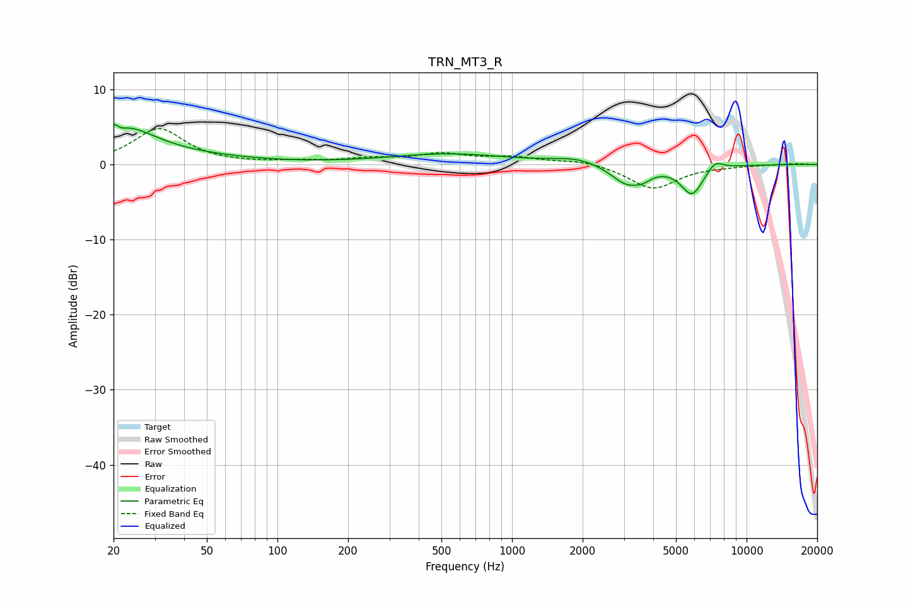

# TRN_MT3_R
See [usage instructions](https://github.com/jaakkopasanen/AutoEq#usage) for more options and info.

### Parametric EQs
Apply preamp of -5.4 dB when using parametric equalizer.

|   # | Type    |   Fc (Hz) |    Q |   Gain (dB) |
|-----|---------|-----------|------|-------------|
|   1 | Peaking |        21 | 5.88 |         3.2 |
|   2 | Peaking |        21 | 5.99 |        -2.8 |
|   3 | Peaking |        22 | 1.11 |         3.7 |
|   4 | Peaking |        27 | 0.4  |         1.2 |
|   5 | Peaking |       537 | 0.56 |         1.4 |
|   6 | Peaking |      1876 | 1.44 |         0.8 |
|   7 | Peaking |      3085 | 2.11 |        -2.6 |
|   8 | Peaking |      3612 | 3.93 |        -0.8 |
|   9 | Peaking |      5856 | 2.89 |        -3.9 |
|  10 | Peaking |      7335 | 4.05 |         1.3 |

### Fixed Band EQs
When using fixed band (also called graphic) equalizer, apply preamp of **-4.8 dB** (if available) and set gains manually with these parameters.

|   # | Type    |   Fc (Hz) |    Q |   Gain (dB) |
|-----|---------|-----------|------|-------------|
|   1 | Peaking |        31 | 1.41 |         4.7 |
|   2 | Peaking |        62 | 1.41 |         0.1 |
|   3 | Peaking |       125 | 1.41 |         0.3 |
|   4 | Peaking |       250 | 1.41 |         0.6 |
|   5 | Peaking |       500 | 1.41 |         1.3 |
|   6 | Peaking |      1000 | 1.41 |         0.9 |
|   7 | Peaking |      2000 | 1.41 |         0.6 |
|   8 | Peaking |      4000 | 1.41 |        -3.3 |
|   9 | Peaking |      8000 | 1.41 |        -0.2 |
|  10 | Peaking |     16000 | 1.41 |         0.1 |

### Graphs

