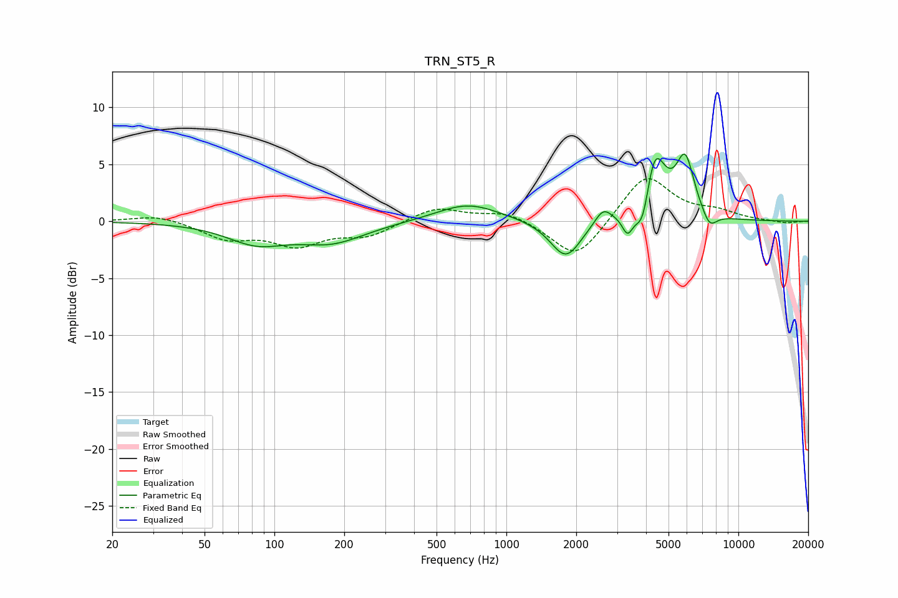

# TRN_ST5_R
See [usage instructions](https://github.com/jaakkopasanen/AutoEq#usage) for more options and info.

### Parametric EQs
Apply preamp of -6.0 dB when using parametric equalizer.

|   # | Type    |   Fc (Hz) |    Q |   Gain (dB) |
|-----|---------|-----------|------|-------------|
|   1 | Peaking |        84 | 1.11 |        -1.7 |
|   2 | Peaking |       177 | 0.96 |        -1.7 |
|   3 | Peaking |       683 | 1.04 |         1.6 |
|   4 | Peaking |      1805 | 2.11 |        -3.4 |
|   5 | Peaking |      2612 | 3.89 |         1.4 |
|   6 | Peaking |      3329 | 6    |        -1.8 |
|   7 | Peaking |      3891 | 4.22 |        -3.9 |
|   8 | Peaking |      4322 | 2.89 |         6.7 |
|   9 | Peaking |      5901 | 3.52 |         5   |
|  10 | Peaking |      7506 | 4.24 |        -1.4 |

### Fixed Band EQs
When using fixed band (also called graphic) equalizer, apply preamp of **-3.8 dB** (if available) and set gains manually with these parameters.

|   # | Type    |   Fc (Hz) |    Q |   Gain (dB) |
|-----|---------|-----------|------|-------------|
|   1 | Peaking |        31 | 1.41 |         0.6 |
|   2 | Peaking |        62 | 1.41 |        -1.4 |
|   3 | Peaking |       125 | 1.41 |        -1.9 |
|   4 | Peaking |       250 | 1.41 |        -1.2 |
|   5 | Peaking |       500 | 1.41 |         1.3 |
|   6 | Peaking |      1000 | 1.41 |         0.9 |
|   7 | Peaking |      2000 | 1.41 |        -3.5 |
|   8 | Peaking |      4000 | 1.41 |         4.2 |
|   9 | Peaking |      8000 | 1.41 |         0.7 |
|  10 | Peaking |     16000 | 1.41 |        -0.2 |

### Graphs

