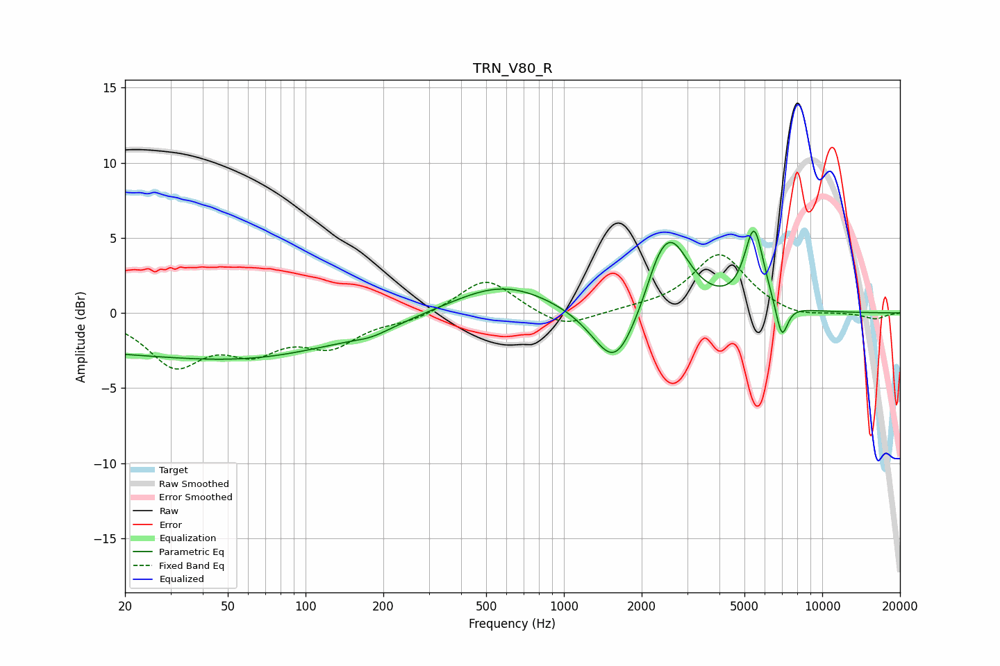

# TRN_V80_R
See [usage instructions](https://github.com/jaakkopasanen/AutoEq#usage) for more options and info.

### Parametric EQs
Apply preamp of -5.6 dB when using parametric equalizer.

|   # | Type    |   Fc (Hz) |    Q |   Gain (dB) |
|-----|---------|-----------|------|-------------|
|   1 | Peaking |        21 | 0.18 |        -2.4 |
|   2 | Peaking |        86 | 0.38 |        -1.1 |
|   3 | Peaking |       180 | 1.82 |        -0.4 |
|   4 | Peaking |       579 | 0.72 |         2   |
|   5 | Peaking |      1580 | 1.63 |        -4.3 |
|   6 | Peaking |      2288 | 3.61 |         0.6 |
|   7 | Peaking |      2571 | 1.84 |         5.2 |
|   8 | Peaking |      5386 | 4.96 |         0.5 |
|   9 | Peaking |      5460 | 3.6  |         4.8 |
|  10 | Peaking |      6974 | 5.8  |        -2.5 |

### Fixed Band EQs
When using fixed band (also called graphic) equalizer, apply preamp of **-4.0 dB** (if available) and set gains manually with these parameters.

|   # | Type    |   Fc (Hz) |    Q |   Gain (dB) |
|-----|---------|-----------|------|-------------|
|   1 | Peaking |        31 | 1.41 |        -3.3 |
|   2 | Peaking |        62 | 1.41 |        -2.1 |
|   3 | Peaking |       125 | 1.41 |        -2   |
|   4 | Peaking |       250 | 1.41 |        -0.5 |
|   5 | Peaking |       500 | 1.41 |         2.4 |
|   6 | Peaking |      1000 | 1.41 |        -1.1 |
|   7 | Peaking |      2000 | 1.41 |         0.2 |
|   8 | Peaking |      4000 | 1.41 |         3.9 |
|   9 | Peaking |      8000 | 1.41 |        -0.4 |
|  10 | Peaking |     16000 | 1.41 |        -0.4 |

### Graphs

