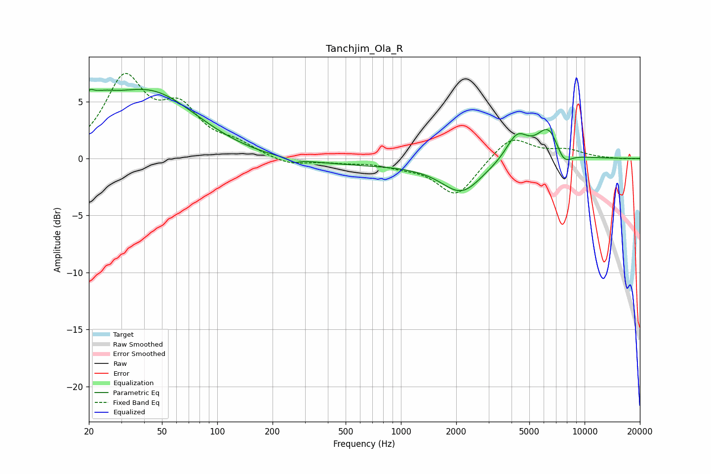

# Tanchjim_Ola_R
See [usage instructions](https://github.com/jaakkopasanen/AutoEq#usage) for more options and info.

### Parametric EQs
Apply preamp of -6.2 dB when using parametric equalizer.

|   # | Type    |   Fc (Hz) |    Q |   Gain (dB) |
|-----|---------|-----------|------|-------------|
|   1 | Peaking |        20 | 5.88 |         1   |
|   2 | Peaking |        22 | 1.52 |         2.4 |
|   3 | Peaking |        23 | 1.53 |        -0.4 |
|   4 | Peaking |        43 | 0.54 |         5.7 |
|   5 | Peaking |       263 | 5.65 |        -0.3 |
|   6 | Peaking |       567 | 0.18 |        -0.6 |
|   7 | Peaking |      2141 | 1.3  |        -2.6 |
|   8 | Peaking |      4283 | 2.34 |         2.3 |
|   9 | Peaking |      6382 | 2.11 |         2.9 |
|  10 | Peaking |      7654 | 2.96 |        -1.5 |

### Fixed Band EQs
When using fixed band (also called graphic) equalizer, apply preamp of **-7.6 dB** (if available) and set gains manually with these parameters.

|   # | Type    |   Fc (Hz) |    Q |   Gain (dB) |
|-----|---------|-----------|------|-------------|
|   1 | Peaking |        31 | 1.41 |         6.7 |
|   2 | Peaking |        62 | 1.41 |         3.8 |
|   3 | Peaking |       125 | 1.41 |         1   |
|   4 | Peaking |       250 | 1.41 |        -0.6 |
|   5 | Peaking |       500 | 1.41 |        -0.3 |
|   6 | Peaking |      1000 | 1.41 |        -0.5 |
|   7 | Peaking |      2000 | 1.41 |        -3.3 |
|   8 | Peaking |      4000 | 1.41 |         2.1 |
|   9 | Peaking |      8000 | 1.41 |         0.7 |
|  10 | Peaking |     16000 | 1.41 |        -0.1 |

### Graphs

