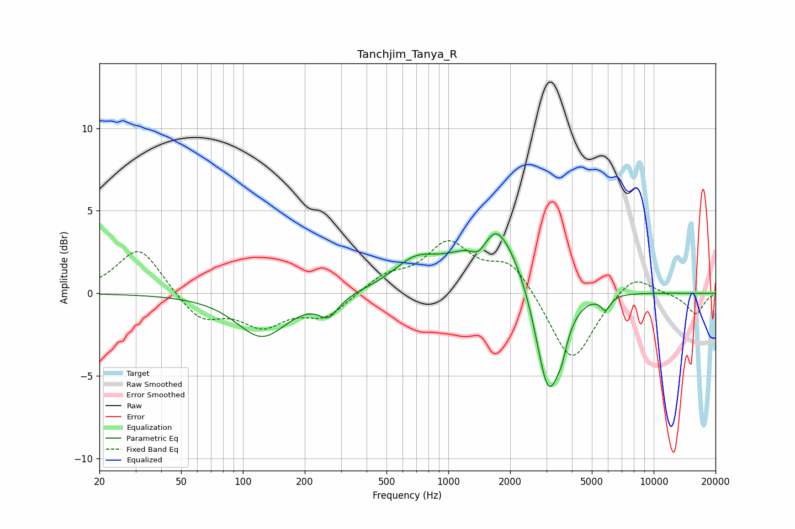

# Tanchjim_Tanya_R
See [usage instructions](https://github.com/jaakkopasanen/AutoEq#usage) for more options and info.

### Parametric EQs
Apply preamp of -3.7 dB when using parametric equalizer.

|   # | Type    |   Fc (Hz) |    Q |   Gain (dB) |
|-----|---------|-----------|------|-------------|
|   1 | Peaking |       124 | 1.15 |        -2.6 |
|   2 | Peaking |       261 | 2.98 |        -1.1 |
|   3 | Peaking |       686 | 1.35 |         1.4 |
|   4 | Peaking |      1401 | 3.79 |        -0.8 |
|   5 | Peaking |      1708 | 3.19 |         0.8 |
|   6 | Peaking |      1733 | 0.75 |         3.6 |
|   7 | Peaking |      1964 | 2.72 |         0.3 |
|   8 | Peaking |      3073 | 2.19 |        -7.4 |
|   9 | Peaking |      3569 | 6    |        -0.8 |
|  10 | Peaking |      5836 | 5.75 |        -0.8 |

### Fixed Band EQs
When using fixed band (also called graphic) equalizer, apply preamp of **-3.3 dB** (if available) and set gains manually with these parameters.

|   # | Type    |   Fc (Hz) |    Q |   Gain (dB) |
|-----|---------|-----------|------|-------------|
|   1 | Peaking |        31 | 1.41 |         2.9 |
|   2 | Peaking |        62 | 1.41 |        -1.6 |
|   3 | Peaking |       125 | 1.41 |        -1.8 |
|   4 | Peaking |       250 | 1.41 |        -1.4 |
|   5 | Peaking |       500 | 1.41 |         1   |
|   6 | Peaking |      1000 | 1.41 |         2.9 |
|   7 | Peaking |      2000 | 1.41 |         1.9 |
|   8 | Peaking |      4000 | 1.41 |        -4.3 |
|   9 | Peaking |      8000 | 1.41 |         1.3 |
|  10 | Peaking |     16000 | 1.41 |        -1.3 |

### Graphs

