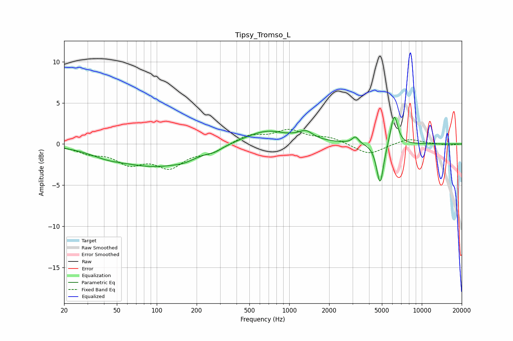

# Tipsy_Tromso_L
See [usage instructions](https://github.com/jaakkopasanen/AutoEq#usage) for more options and info.

### Parametric EQs
Apply preamp of -3.4 dB when using parametric equalizer.

|   # | Type    |   Fc (Hz) |    Q |   Gain (dB) |
|-----|---------|-----------|------|-------------|
|   1 | Peaking |        42 | 1.15 |        -0.6 |
|   2 | Peaking |        99 | 0.5  |        -2.6 |
|   3 | Peaking |       160 | 1.99 |        -0.3 |
|   4 | Peaking |       274 | 2.84 |        -0.3 |
|   5 | Peaking |       691 | 0.76 |         1.8 |
|   6 | Peaking |       912 | 2.62 |        -0.1 |
|   7 | Peaking |      1338 | 2.81 |         0.9 |
|   8 | Peaking |      3151 | 5.98 |         0.8 |
|   9 | Peaking |      4847 | 5.27 |        -5.1 |
|  10 | Peaking |      6191 | 5.07 |         3.8 |

### Fixed Band EQs
When using fixed band (also called graphic) equalizer, apply preamp of **-1.9 dB** (if available) and set gains manually with these parameters.

|   # | Type    |   Fc (Hz) |    Q |   Gain (dB) |
|-----|---------|-----------|------|-------------|
|   1 | Peaking |        31 | 1.41 |        -0.9 |
|   2 | Peaking |        62 | 1.41 |        -2.1 |
|   3 | Peaking |       125 | 1.41 |        -2.6 |
|   4 | Peaking |       250 | 1.41 |        -0.9 |
|   5 | Peaking |       500 | 1.41 |         1.1 |
|   6 | Peaking |      1000 | 1.41 |         1.6 |
|   7 | Peaking |      2000 | 1.41 |         0.7 |
|   8 | Peaking |      4000 | 1.41 |        -1.3 |
|   9 | Peaking |      8000 | 1.41 |         0.7 |
|  10 | Peaking |     16000 | 1.41 |        -0.2 |

### Graphs

