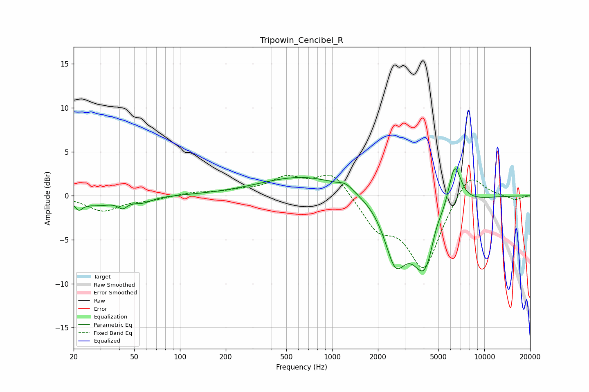

# Tripowin_Cencibel_R
See [usage instructions](https://github.com/jaakkopasanen/AutoEq#usage) for more options and info.

### Parametric EQs
Apply preamp of -3.2 dB when using parametric equalizer.

|   # | Type    |   Fc (Hz) |    Q |   Gain (dB) |
|-----|---------|-----------|------|-------------|
|   1 | Peaking |        22 | 5.68 |        -1   |
|   2 | Peaking |        29 | 1.28 |        -1   |
|   3 | Peaking |        42 | 4.76 |        -0.8 |
|   4 | Peaking |        57 | 2.29 |        -0.6 |
|   5 | Peaking |       663 | 0.49 |         2.2 |
|   6 | Peaking |      1229 | 3.15 |         0.6 |
|   7 | Peaking |      2601 | 1.99 |        -6.4 |
|   8 | Peaking |      4098 | 1.63 |        -8.4 |
|   9 | Peaking |      4800 | 3.22 |         1.9 |
|  10 | Peaking |      6380 | 3.14 |         5.3 |

### Fixed Band EQs
When using fixed band (also called graphic) equalizer, apply preamp of **-2.4 dB** (if available) and set gains manually with these parameters.

|   # | Type    |   Fc (Hz) |    Q |   Gain (dB) |
|-----|---------|-----------|------|-------------|
|   1 | Peaking |        31 | 1.41 |        -1.7 |
|   2 | Peaking |        62 | 1.41 |        -0.4 |
|   3 | Peaking |       125 | 1.41 |         0.4 |
|   4 | Peaking |       250 | 1.41 |         0.5 |
|   5 | Peaking |       500 | 1.41 |         1.9 |
|   6 | Peaking |      1000 | 1.41 |         2.8 |
|   7 | Peaking |      2000 | 1.41 |        -3.3 |
|   8 | Peaking |      4000 | 1.41 |        -8.1 |
|   9 | Peaking |      8000 | 1.41 |         3.1 |
|  10 | Peaking |     16000 | 1.41 |        -0.5 |

### Graphs

