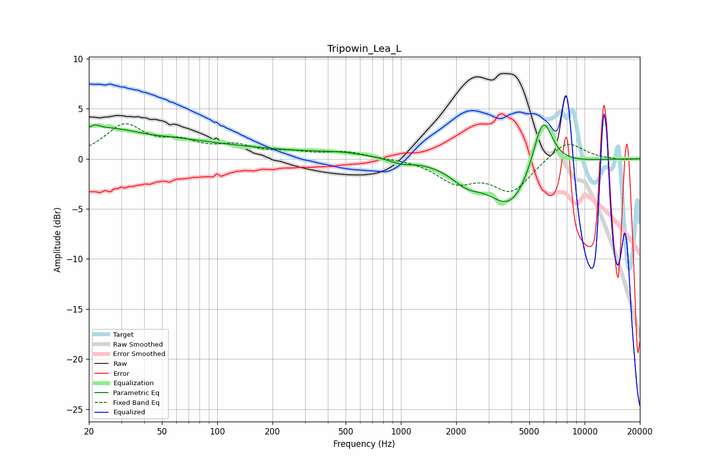

# Tripowin_Lea_L
See [usage instructions](https://github.com/jaakkopasanen/AutoEq#usage) for more options and info.

### Parametric EQs
Apply preamp of -3.5 dB when using parametric equalizer.

|   # | Type    |   Fc (Hz) |    Q |   Gain (dB) |
|-----|---------|-----------|------|-------------|
|   1 | Peaking |        22 | 5.91 |         3.2 |
|   2 | Peaking |        22 | 6    |        -2.8 |
|   3 | Peaking |        25 | 0.45 |         2.7 |
|   4 | Peaking |        41 | 1.07 |        -0.5 |
|   5 | Peaking |        90 | 0.28 |         1   |
|   6 | Peaking |       489 | 0.96 |         0.4 |
|   7 | Peaking |       998 | 2.58 |        -0.4 |
|   8 | Peaking |      2275 | 1.66 |        -1.6 |
|   9 | Peaking |      3939 | 1.18 |        -4.7 |
|  10 | Peaking |      5919 | 2.55 |         5.6 |

### Fixed Band EQs
When using fixed band (also called graphic) equalizer, apply preamp of **-3.6 dB** (if available) and set gains manually with these parameters.

|   # | Type    |   Fc (Hz) |    Q |   Gain (dB) |
|-----|---------|-----------|------|-------------|
|   1 | Peaking |        31 | 1.41 |         3.2 |
|   2 | Peaking |        62 | 1.41 |         1.3 |
|   3 | Peaking |       125 | 1.41 |         1.1 |
|   4 | Peaking |       250 | 1.41 |         0.5 |
|   5 | Peaking |       500 | 1.41 |         0.6 |
|   6 | Peaking |      1000 | 1.41 |         0   |
|   7 | Peaking |      2000 | 1.41 |        -2.2 |
|   8 | Peaking |      4000 | 1.41 |        -3.1 |
|   9 | Peaking |      8000 | 1.41 |         1.9 |
|  10 | Peaking |     16000 | 1.41 |        -0.1 |

### Graphs

