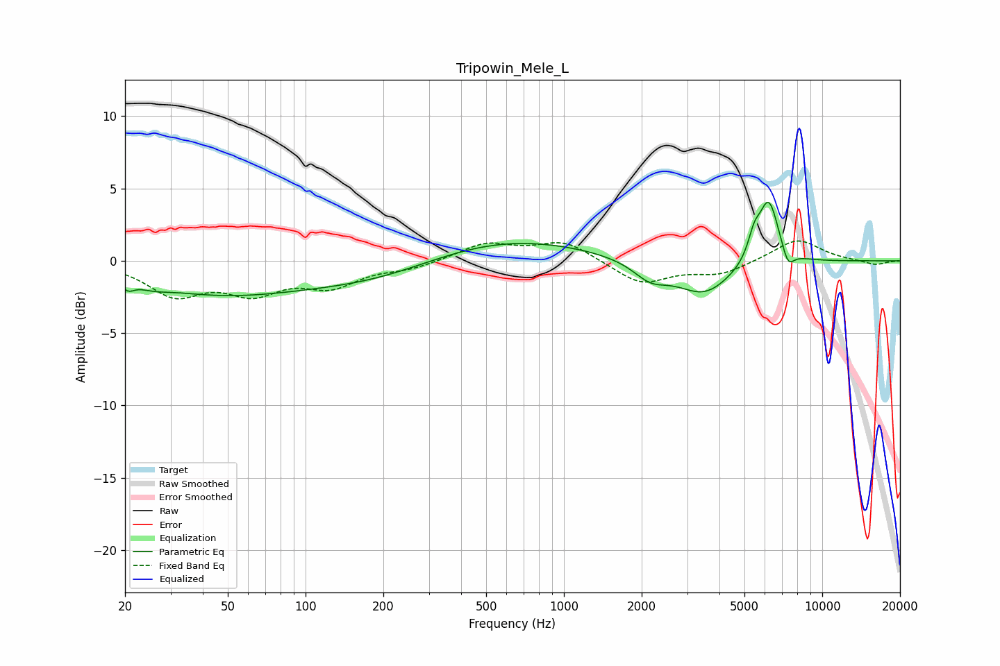

# Tripowin_Mele_L
See [usage instructions](https://github.com/jaakkopasanen/AutoEq#usage) for more options and info.

### Parametric EQs
Apply preamp of -4.1 dB when using parametric equalizer.

|   # | Type    |   Fc (Hz) |    Q |   Gain (dB) |
|-----|---------|-----------|------|-------------|
|   1 | Peaking |        21 | 5.81 |        -0.6 |
|   2 | Peaking |        26 | 2.51 |        -0.3 |
|   3 | Peaking |        46 | 0.44 |        -2.2 |
|   4 | Peaking |       191 | 0.52 |        -1.3 |
|   5 | Peaking |       566 | 0.43 |         1.7 |
|   6 | Peaking |      2165 | 2.11 |        -1.2 |
|   7 | Peaking |      3491 | 1.28 |        -2.4 |
|   8 | Peaking |      5446 | 5.99 |         1.4 |
|   9 | Peaking |      6202 | 3.43 |         4.5 |
|  10 | Peaking |      7371 | 5.85 |        -1.2 |

### Fixed Band EQs
When using fixed band (also called graphic) equalizer, apply preamp of **-1.5 dB** (if available) and set gains manually with these parameters.

|   # | Type    |   Fc (Hz) |    Q |   Gain (dB) |
|-----|---------|-----------|------|-------------|
|   1 | Peaking |        31 | 1.41 |        -2.2 |
|   2 | Peaking |        62 | 1.41 |        -1.9 |
|   3 | Peaking |       125 | 1.41 |        -1.6 |
|   4 | Peaking |       250 | 1.41 |        -0.5 |
|   5 | Peaking |       500 | 1.41 |         1.2 |
|   6 | Peaking |      1000 | 1.41 |         1.3 |
|   7 | Peaking |      2000 | 1.41 |        -1.6 |
|   8 | Peaking |      4000 | 1.41 |        -0.9 |
|   9 | Peaking |      8000 | 1.41 |         1.5 |
|  10 | Peaking |     16000 | 1.41 |        -0.3 |

### Graphs

