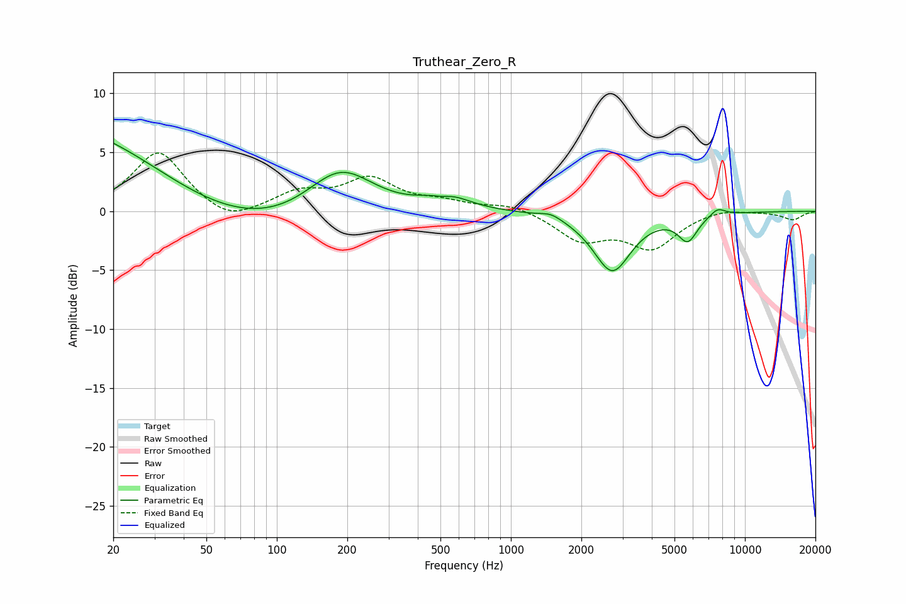

# Truthear_Zero_R
See [usage instructions](https://github.com/jaakkopasanen/AutoEq#usage) for more options and info.

### Parametric EQs
Apply preamp of -5.9 dB when using parametric equalizer.

|   # | Type    |   Fc (Hz) |    Q |   Gain (dB) |
|-----|---------|-----------|------|-------------|
|   1 | Peaking |        20 | 0.22 |        10.5 |
|   2 | Peaking |        53 | 0.33 |        -7.6 |
|   3 | Peaking |       187 | 0.96 |         4.4 |
|   4 | Peaking |       509 | 2.78 |        -0.7 |
|   5 | Peaking |       521 | 1.67 |         1.6 |
|   6 | Peaking |      1485 | 3.1  |         0.4 |
|   7 | Peaking |      2486 | 2.64 |         0.2 |
|   8 | Peaking |      2698 | 1.76 |        -5.2 |
|   9 | Peaking |      5698 | 3.34 |        -2.2 |
|  10 | Peaking |      7644 | 4.14 |         0.7 |

### Fixed Band EQs
When using fixed band (also called graphic) equalizer, apply preamp of **-5.0 dB** (if available) and set gains manually with these parameters.

|   # | Type    |   Fc (Hz) |    Q |   Gain (dB) |
|-----|---------|-----------|------|-------------|
|   1 | Peaking |        31 | 1.41 |         5.1 |
|   2 | Peaking |        62 | 1.41 |        -1.2 |
|   3 | Peaking |       125 | 1.41 |         1.5 |
|   4 | Peaking |       250 | 1.41 |         2.6 |
|   5 | Peaking |       500 | 1.41 |         0.7 |
|   6 | Peaking |      1000 | 1.41 |         0.6 |
|   7 | Peaking |      2000 | 1.41 |        -2.3 |
|   8 | Peaking |      4000 | 1.41 |        -3   |
|   9 | Peaking |      8000 | 1.41 |         0.4 |
|  10 | Peaking |     16000 | 1.41 |        -0.7 |

### Graphs

