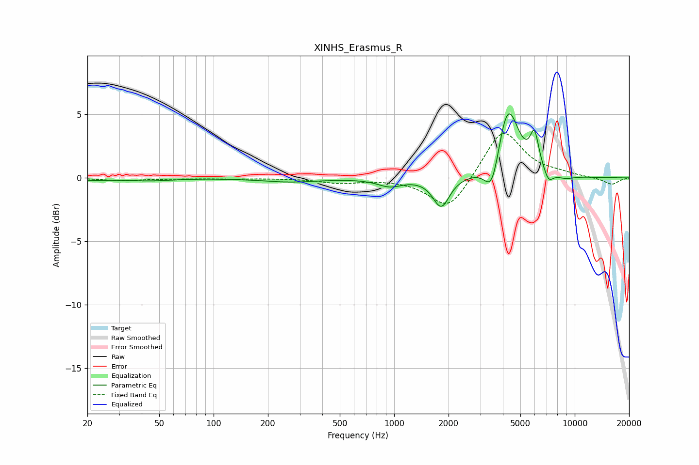

# XINHS_Erasmus_R
See [usage instructions](https://github.com/jaakkopasanen/AutoEq#usage) for more options and info.

### Parametric EQs
Apply preamp of -5.1 dB when using parametric equalizer.

|   # | Type    |   Fc (Hz) |    Q |   Gain (dB) |
|-----|---------|-----------|------|-------------|
|   1 | Peaking |        21 | 1.51 |        -0.2 |
|   2 | Peaking |        44 | 1.15 |        -0.2 |
|   3 | Peaking |       266 | 0.9  |        -0.3 |
|   4 | Peaking |       947 | 2.09 |        -0.6 |
|   5 | Peaking |      1822 | 3.11 |        -2.3 |
|   6 | Peaking |      3492 | 3.38 |        -2.9 |
|   7 | Peaking |      4253 | 2.31 |         5.9 |
|   8 | Peaking |      5985 | 5.6  |         2.7 |
|   9 | Peaking |      7158 | 5.12 |        -1   |
|  10 | Peaking |      8847 | 2.69 |        -0.3 |

### Fixed Band EQs
When using fixed band (also called graphic) equalizer, apply preamp of **-3.6 dB** (if available) and set gains manually with these parameters.

|   # | Type    |   Fc (Hz) |    Q |   Gain (dB) |
|-----|---------|-----------|------|-------------|
|   1 | Peaking |        31 | 1.41 |        -0.2 |
|   2 | Peaking |        62 | 1.41 |        -0   |
|   3 | Peaking |       125 | 1.41 |        -0.1 |
|   4 | Peaking |       250 | 1.41 |        -0   |
|   5 | Peaking |       500 | 1.41 |        -0.4 |
|   6 | Peaking |      1000 | 1.41 |        -0.1 |
|   7 | Peaking |      2000 | 1.41 |        -2.6 |
|   8 | Peaking |      4000 | 1.41 |         3.9 |
|   9 | Peaking |      8000 | 1.41 |         0.3 |
|  10 | Peaking |     16000 | 1.41 |        -0.5 |

### Graphs

