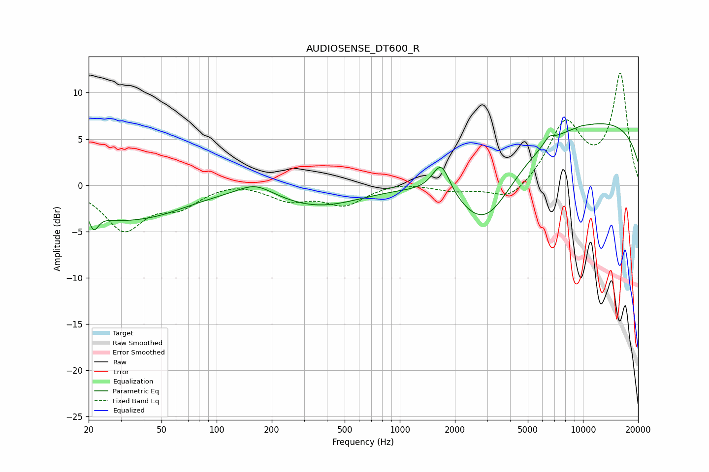

# AUDIOSENSE_DT600_R
See [usage instructions](https://github.com/jaakkopasanen/AutoEq#usage) for more options and info.

### Parametric EQs
Apply preamp of -6.7 dB when using parametric equalizer.

|   # | Type    |   Fc (Hz) |    Q |   Gain (dB) |
|-----|---------|-----------|------|-------------|
|   1 | Peaking |        21 | 5.4  |        -2.1 |
|   2 | Peaking |        26 | 1.1  |        -1.5 |
|   3 | Peaking |        43 | 0.62 |        -2.8 |
|   4 | Peaking |       162 | 1.46 |         1.4 |
|   5 | Peaking |       360 | 0.6  |        -2.2 |
|   6 | Peaking |      1683 | 2.91 |         3.5 |
|   7 | Peaking |      2921 | 0.83 |        -8.1 |
|   8 | Peaking |      6516 | 5.23 |         0.7 |
|   9 | Peaking |      9819 | 5.97 |         0.1 |
|  10 | Peaking |     10000 | 0.18 |         7.2 |

### Fixed Band EQs
When using fixed band (also called graphic) equalizer, apply preamp of **-12.2 dB** (if available) and set gains manually with these parameters.

|   # | Type    |   Fc (Hz) |    Q |   Gain (dB) |
|-----|---------|-----------|------|-------------|
|   1 | Peaking |        31 | 1.41 |        -4.7 |
|   2 | Peaking |        62 | 1.41 |        -2   |
|   3 | Peaking |       125 | 1.41 |         0.5 |
|   4 | Peaking |       250 | 1.41 |        -1.5 |
|   5 | Peaking |       500 | 1.41 |        -2   |
|   6 | Peaking |      1000 | 1.41 |         0.4 |
|   7 | Peaking |      2000 | 1.41 |        -0.6 |
|   8 | Peaking |      4000 | 1.41 |        -1.9 |
|   9 | Peaking |      8000 | 1.41 |         6.6 |
|  10 | Peaking |     16000 | 1.41 |        11.9 |

### Graphs

