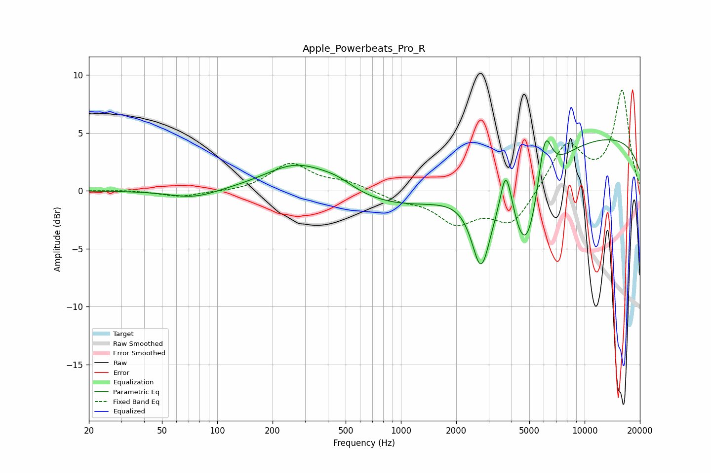

# Apple_Powerbeats_Pro_R
See [usage instructions](https://github.com/jaakkopasanen/AutoEq#usage) for more options and info.

### Parametric EQs
Apply preamp of -4.5 dB when using parametric equalizer.

|   # | Type    |   Fc (Hz) |    Q |   Gain (dB) |
|-----|---------|-----------|------|-------------|
|   1 | Peaking |        75 | 1.1  |        -0.7 |
|   2 | Peaking |       275 | 0.79 |         2.6 |
|   3 | Peaking |       449 | 1.45 |         0.8 |
|   4 | Peaking |      1572 | 0.29 |        -2.2 |
|   5 | Peaking |      2730 | 2.77 |        -6.4 |
|   6 | Peaking |      3719 | 4.67 |         3.9 |
|   7 | Peaking |      3995 | 3.86 |         0.8 |
|   8 | Peaking |      4800 | 1.6  |        -8.2 |
|   9 | Peaking |      6064 | 3.58 |         5.2 |
|  10 | Peaking |     10000 | 0.18 |         4.9 |

### Fixed Band EQs
When using fixed band (also called graphic) equalizer, apply preamp of **-8.8 dB** (if available) and set gains manually with these parameters.

|   # | Type    |   Fc (Hz) |    Q |   Gain (dB) |
|-----|---------|-----------|------|-------------|
|   1 | Peaking |        31 | 1.41 |         0.1 |
|   2 | Peaking |        62 | 1.41 |        -0.5 |
|   3 | Peaking |       125 | 1.41 |        -0.1 |
|   4 | Peaking |       250 | 1.41 |         2.3 |
|   5 | Peaking |       500 | 1.41 |         0.7 |
|   6 | Peaking |      1000 | 1.41 |        -0.7 |
|   7 | Peaking |      2000 | 1.41 |        -2.6 |
|   8 | Peaking |      4000 | 1.41 |        -2.9 |
|   9 | Peaking |      8000 | 1.41 |         4.1 |
|  10 | Peaking |     16000 | 1.41 |         8.6 |

### Graphs

