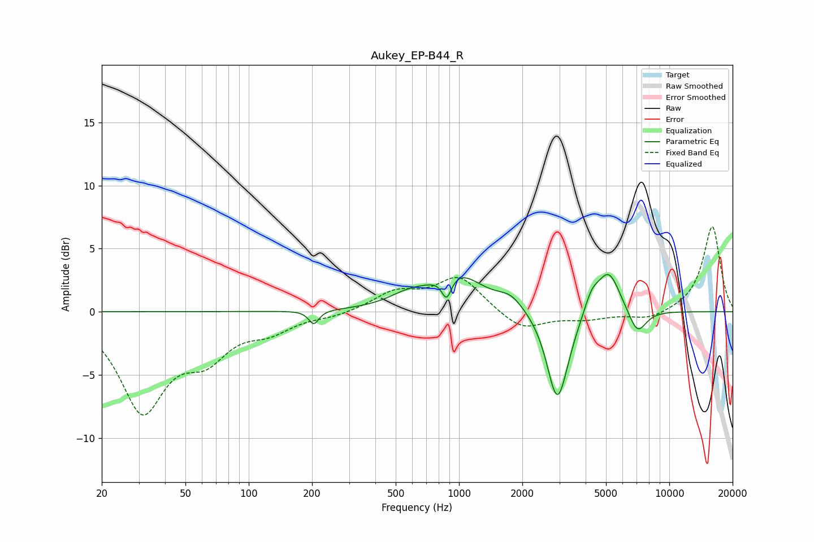

# Aukey_EP-B44_R
See [usage instructions](https://github.com/jaakkopasanen/AutoEq#usage) for more options and info.

### Parametric EQs
Apply preamp of -3.0 dB when using parametric equalizer.

|   # | Type    |   Fc (Hz) |    Q |   Gain (dB) |
|-----|---------|-----------|------|-------------|
|   1 | Peaking |       204 | 6    |        -1.1 |
|   2 | Peaking |       574 | 1.47 |         0.9 |
|   3 | Peaking |       873 | 6    |        -1.8 |
|   4 | Peaking |       982 | 1.2  |         2.9 |
|   5 | Peaking |      1763 | 2.25 |         1   |
|   6 | Peaking |      2923 | 2.92 |        -6.3 |
|   7 | Peaking |      3127 | 2.32 |        -1.2 |
|   8 | Peaking |      4273 | 3.93 |         1.4 |
|   9 | Peaking |      5149 | 2.5  |         3.4 |
|  10 | Peaking |      7049 | 3.15 |        -2   |

### Fixed Band EQs
When using fixed band (also called graphic) equalizer, apply preamp of **-6.8 dB** (if available) and set gains manually with these parameters.

|   # | Type    |   Fc (Hz) |    Q |   Gain (dB) |
|-----|---------|-----------|------|-------------|
|   1 | Peaking |        31 | 1.41 |        -7.6 |
|   2 | Peaking |        62 | 1.41 |        -2.9 |
|   3 | Peaking |       125 | 1.41 |        -1.3 |
|   4 | Peaking |       250 | 1.41 |        -0.3 |
|   5 | Peaking |       500 | 1.41 |         1.5 |
|   6 | Peaking |      1000 | 1.41 |         2.7 |
|   7 | Peaking |      2000 | 1.41 |        -1.5 |
|   8 | Peaking |      4000 | 1.41 |        -0.5 |
|   9 | Peaking |      8000 | 1.41 |        -0.6 |
|  10 | Peaking |     16000 | 1.41 |         6.8 |

### Graphs

