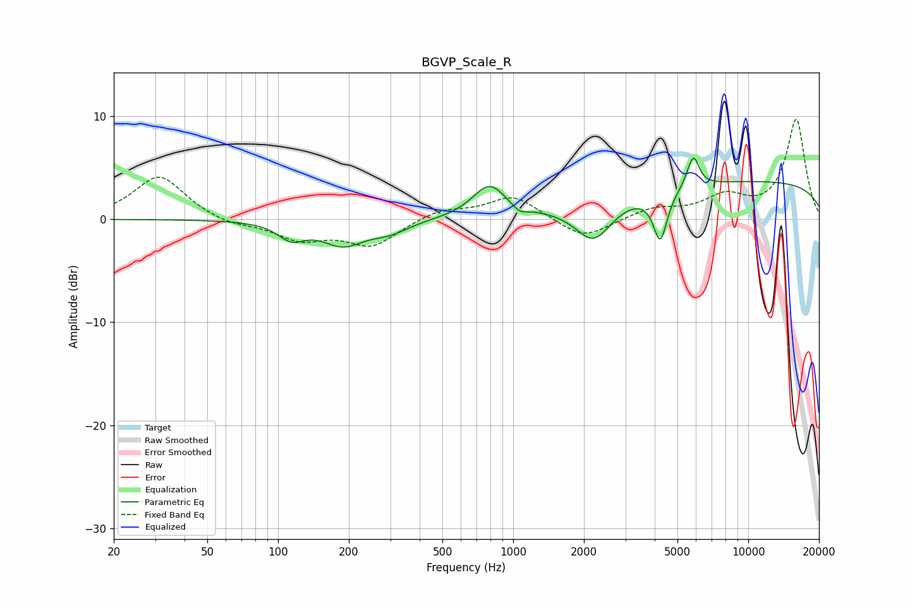

# BGVP_Scale_R
See [usage instructions](https://github.com/jaakkopasanen/AutoEq#usage) for more options and info.

### Parametric EQs
Apply preamp of -6.1 dB when using parametric equalizer.

|   # | Type    |   Fc (Hz) |    Q |   Gain (dB) |
|-----|---------|-----------|------|-------------|
|   1 | Peaking |       114 | 2.51 |        -1.6 |
|   2 | Peaking |       189 | 1.57 |        -2.3 |
|   3 | Peaking |       299 | 1.71 |        -1   |
|   4 | Peaking |       792 | 2.01 |         3.2 |
|   5 | Peaking |      1065 | 4.41 |        -0.7 |
|   6 | Peaking |      2199 | 1.82 |        -3.8 |
|   7 | Peaking |      4225 | 4.81 |        -4.7 |
|   8 | Peaking |      5585 | 5.58 |         0.5 |
|   9 | Peaking |      5867 | 5.89 |         2.7 |
|  10 | Peaking |     10000 | 0.18 |         3.7 |

### Fixed Band EQs
When using fixed band (also called graphic) equalizer, apply preamp of **-9.8 dB** (if available) and set gains manually with these parameters.

|   # | Type    |   Fc (Hz) |    Q |   Gain (dB) |
|-----|---------|-----------|------|-------------|
|   1 | Peaking |        31 | 1.41 |         4.3 |
|   2 | Peaking |        62 | 1.41 |        -0.6 |
|   3 | Peaking |       125 | 1.41 |        -1.8 |
|   4 | Peaking |       250 | 1.41 |        -2.5 |
|   5 | Peaking |       500 | 1.41 |         1   |
|   6 | Peaking |      1000 | 1.41 |         2.3 |
|   7 | Peaking |      2000 | 1.41 |        -2   |
|   8 | Peaking |      4000 | 1.41 |         1   |
|   9 | Peaking |      8000 | 1.41 |         2   |
|  10 | Peaking |     16000 | 1.41 |         9.7 |

### Graphs

