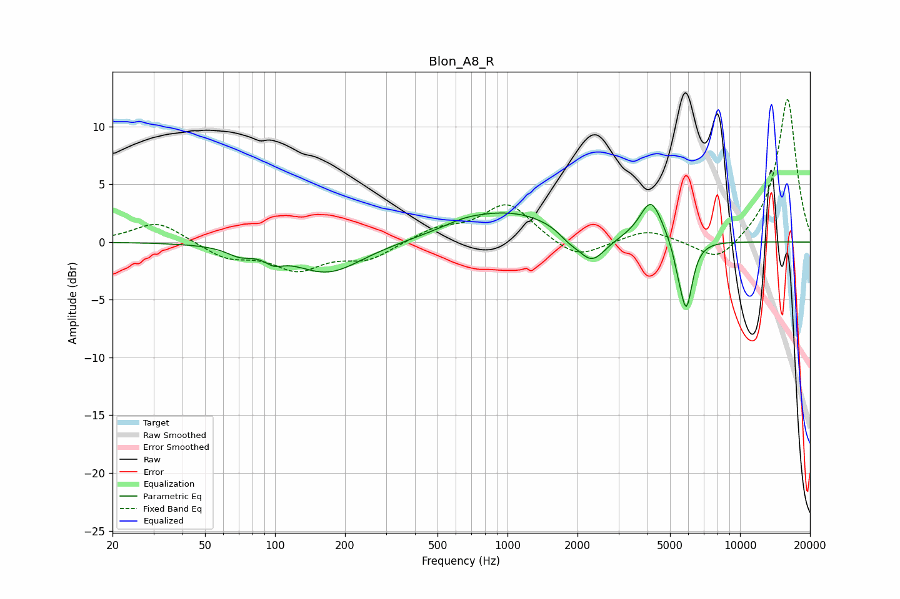

# Blon_A8_R
See [usage instructions](https://github.com/jaakkopasanen/AutoEq#usage) for more options and info.

### Parametric EQs
Apply preamp of -3.4 dB when using parametric equalizer.

|   # | Type    |   Fc (Hz) |    Q |   Gain (dB) |
|-----|---------|-----------|------|-------------|
|   1 | Peaking |        70 | 2.64 |        -0.7 |
|   2 | Peaking |        99 | 3.6  |        -0.7 |
|   3 | Peaking |       169 | 0.96 |        -2.7 |
|   4 | Peaking |       649 | 1.44 |         0.5 |
|   5 | Peaking |      1047 | 0.64 |         2.6 |
|   6 | Peaking |      1825 | 3.31 |        -0.6 |
|   7 | Peaking |      2298 | 2.3  |        -2.6 |
|   8 | Peaking |      4146 | 2.86 |         3.6 |
|   9 | Peaking |      5437 | 6    |        -1.2 |
|  10 | Peaking |      5880 | 5.21 |        -5.7 |

### Fixed Band EQs
When using fixed band (also called graphic) equalizer, apply preamp of **-12.4 dB** (if available) and set gains manually with these parameters.

|   # | Type    |   Fc (Hz) |    Q |   Gain (dB) |
|-----|---------|-----------|------|-------------|
|   1 | Peaking |        31 | 1.41 |         1.8 |
|   2 | Peaking |        62 | 1.41 |        -1.3 |
|   3 | Peaking |       125 | 1.41 |        -2.2 |
|   4 | Peaking |       250 | 1.41 |        -1.4 |
|   5 | Peaking |       500 | 1.41 |         1.1 |
|   6 | Peaking |      1000 | 1.41 |         3.3 |
|   7 | Peaking |      2000 | 1.41 |        -1.6 |
|   8 | Peaking |      4000 | 1.41 |         1.1 |
|   9 | Peaking |      8000 | 1.41 |        -2   |
|  10 | Peaking |     16000 | 1.41 |        12.5 |

### Graphs

