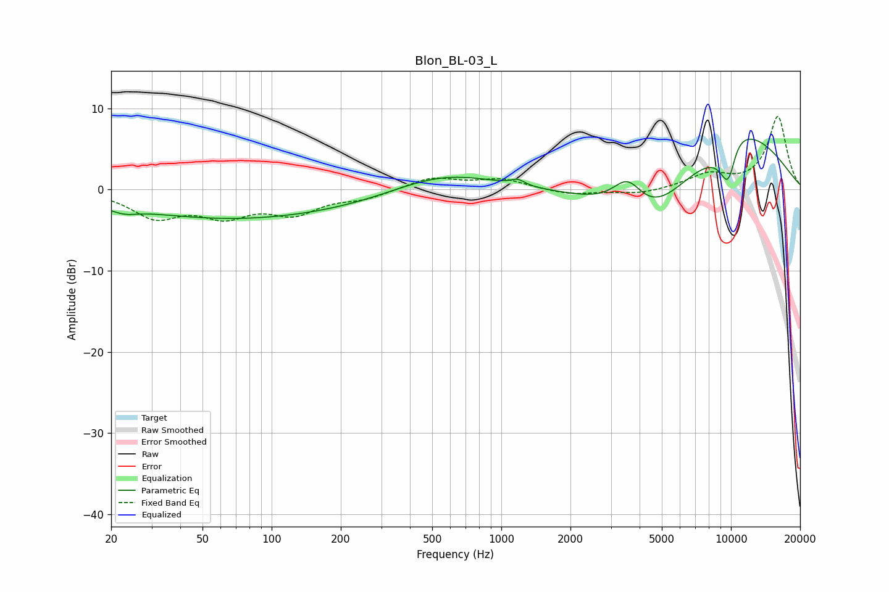

# Blon_BL-03_L
See [usage instructions](https://github.com/jaakkopasanen/AutoEq#usage) for more options and info.

### Parametric EQs
Apply preamp of -6.3 dB when using parametric equalizer.

|   # | Type    |   Fc (Hz) |    Q |   Gain (dB) |
|-----|---------|-----------|------|-------------|
|   1 | Peaking |        23 | 2.51 |        -0.7 |
|   2 | Peaking |        33 | 0.28 |        -1.3 |
|   3 | Peaking |       159 | 0.19 |        -3   |
|   4 | Peaking |       552 | 0.57 |         3.7 |
|   5 | Peaking |      1180 | 4.83 |         0.7 |
|   6 | Peaking |      3548 | 2.1  |         3.9 |
|   7 | Peaking |      4407 | 0.75 |        -6.4 |
|   8 | Peaking |      9763 | 1.5  |       -20   |
|   9 | Peaking |     10000 | 0.98 |        18.9 |
|  10 | Peaking |     10000 | 0.46 |         4.4 |

### Fixed Band EQs
When using fixed band (also called graphic) equalizer, apply preamp of **-9.1 dB** (if available) and set gains manually with these parameters.

|   # | Type    |   Fc (Hz) |    Q |   Gain (dB) |
|-----|---------|-----------|------|-------------|
|   1 | Peaking |        31 | 1.41 |        -3.2 |
|   2 | Peaking |        62 | 1.41 |        -2.8 |
|   3 | Peaking |       125 | 1.41 |        -2.6 |
|   4 | Peaking |       250 | 1.41 |        -1   |
|   5 | Peaking |       500 | 1.41 |         1.5 |
|   6 | Peaking |      1000 | 1.41 |         1.2 |
|   7 | Peaking |      2000 | 1.41 |        -0.7 |
|   8 | Peaking |      4000 | 1.41 |        -0.6 |
|   9 | Peaking |      8000 | 1.41 |         1.7 |
|  10 | Peaking |     16000 | 1.41 |         9   |

### Graphs

