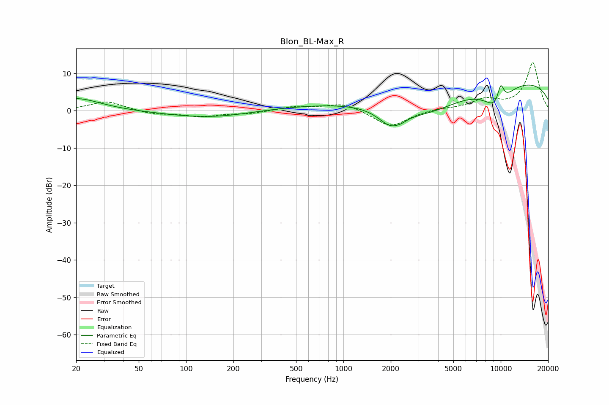

# Blon_BL-Max_R
See [usage instructions](https://github.com/jaakkopasanen/AutoEq#usage) for more options and info.

### Parametric EQs
Apply preamp of -7.0 dB when using parametric equalizer.

|   # | Type    |   Fc (Hz) |    Q |   Gain (dB) |
|-----|---------|-----------|------|-------------|
|   1 | Peaking |        20 | 0.93 |         3.4 |
|   2 | Peaking |       153 | 0.5  |        -2.3 |
|   3 | Peaking |       801 | 0.23 |         1.7 |
|   4 | Peaking |      2016 | 1.68 |        -5.3 |
|   5 | Peaking |      2353 | 5.94 |        -0.3 |
|   6 | Peaking |      3548 | 0.62 |        -6.4 |
|   7 | Peaking |      9462 | 1.59 |        -6.3 |
|   8 | Peaking |     10000 | 6    |         2.3 |
|   9 | Peaking |     10000 | 0.18 |         8.6 |
|  10 | Peaking |     10000 | 5.21 |         3   |

### Fixed Band EQs
When using fixed band (also called graphic) equalizer, apply preamp of **-13.0 dB** (if available) and set gains manually with these parameters.

|   # | Type    |   Fc (Hz) |    Q |   Gain (dB) |
|-----|---------|-----------|------|-------------|
|   1 | Peaking |        31 | 1.41 |         2.6 |
|   2 | Peaking |        62 | 1.41 |        -1   |
|   3 | Peaking |       125 | 1.41 |        -1.5 |
|   4 | Peaking |       250 | 1.41 |        -0.7 |
|   5 | Peaking |       500 | 1.41 |         1.1 |
|   6 | Peaking |      1000 | 1.41 |         2.1 |
|   7 | Peaking |      2000 | 1.41 |        -4.4 |
|   8 | Peaking |      4000 | 1.41 |         0.5 |
|   9 | Peaking |      8000 | 1.41 |         2.7 |
|  10 | Peaking |     16000 | 1.41 |        12.8 |

### Graphs

