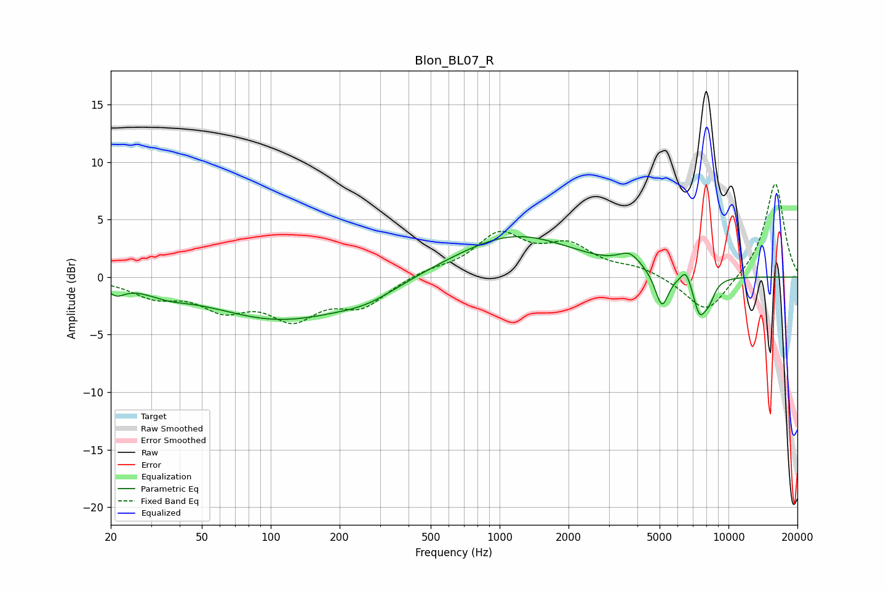

# Blon_BL07_R
See [usage instructions](https://github.com/jaakkopasanen/AutoEq#usage) for more options and info.

### Parametric EQs
Apply preamp of -3.6 dB when using parametric equalizer.

|   # | Type    |   Fc (Hz) |    Q |   Gain (dB) |
|-----|---------|-----------|------|-------------|
|   1 | Peaking |        21 | 3.95 |        -0.9 |
|   2 | Peaking |        36 | 1.54 |        -0.6 |
|   3 | Peaking |       110 | 0.46 |        -3.6 |
|   4 | Peaking |       266 | 1.07 |        -1   |
|   5 | Peaking |      1163 | 0.54 |         3.7 |
|   6 | Peaking |      3706 | 2.77 |         1.3 |
|   7 | Peaking |      5117 | 4.8  |        -3.1 |
|   8 | Peaking |      6526 | 5.98 |         1.3 |
|   9 | Peaking |      7490 | 4.36 |        -3.2 |
|  10 | Peaking |      8259 | 5.4  |        -1.2 |

### Fixed Band EQs
When using fixed band (also called graphic) equalizer, apply preamp of **-8.2 dB** (if available) and set gains manually with these parameters.

|   # | Type    |   Fc (Hz) |    Q |   Gain (dB) |
|-----|---------|-----------|------|-------------|
|   1 | Peaking |        31 | 1.41 |        -1.5 |
|   2 | Peaking |        62 | 1.41 |        -2.4 |
|   3 | Peaking |       125 | 1.41 |        -3.2 |
|   4 | Peaking |       250 | 1.41 |        -2.3 |
|   5 | Peaking |       500 | 1.41 |         0.5 |
|   6 | Peaking |      1000 | 1.41 |         3.5 |
|   7 | Peaking |      2000 | 1.41 |         2.4 |
|   8 | Peaking |      4000 | 1.41 |         0.7 |
|   9 | Peaking |      8000 | 1.41 |        -3.3 |
|  10 | Peaking |     16000 | 1.41 |         8.3 |

### Graphs

